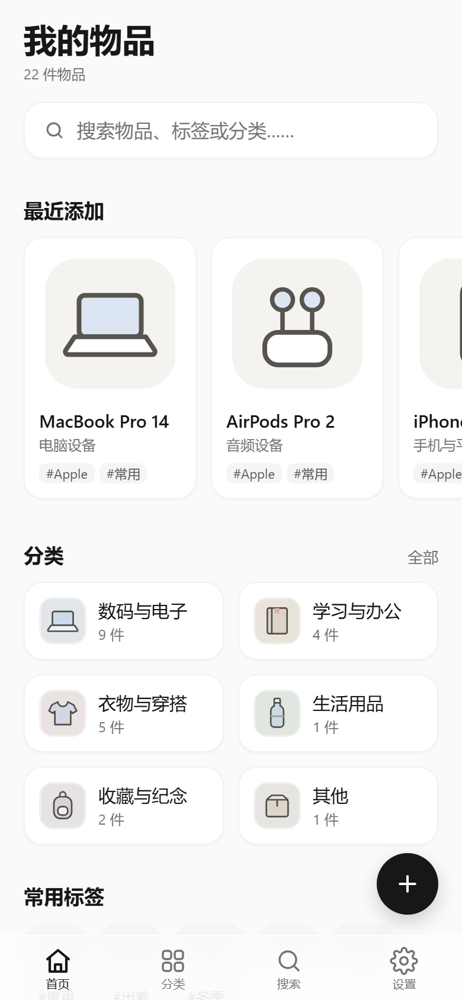
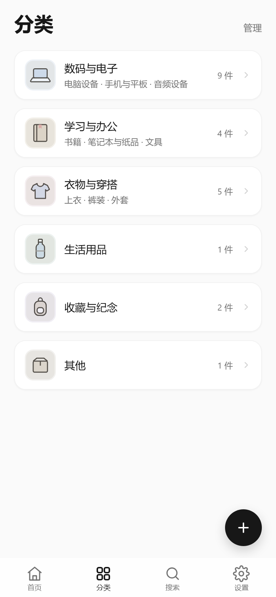
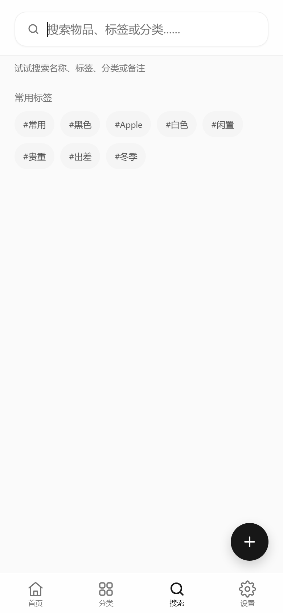
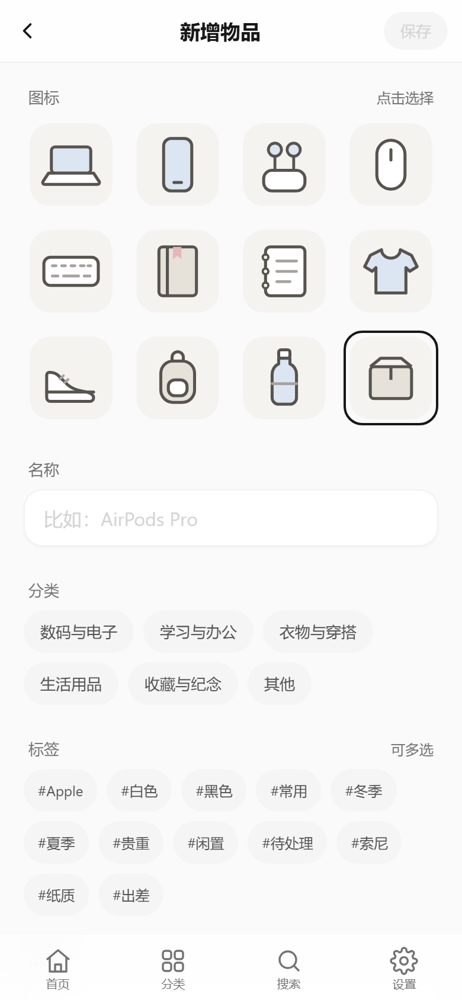
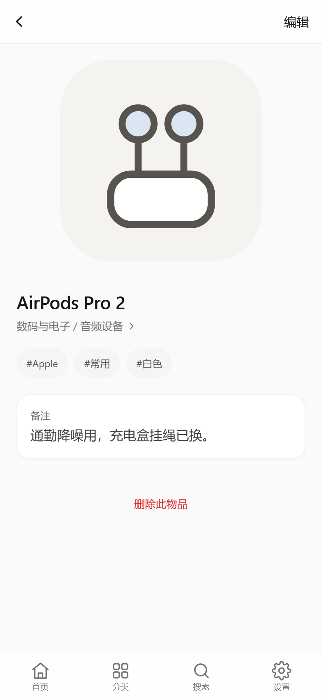
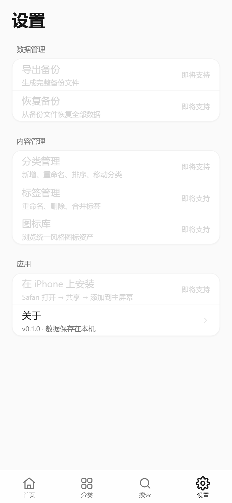
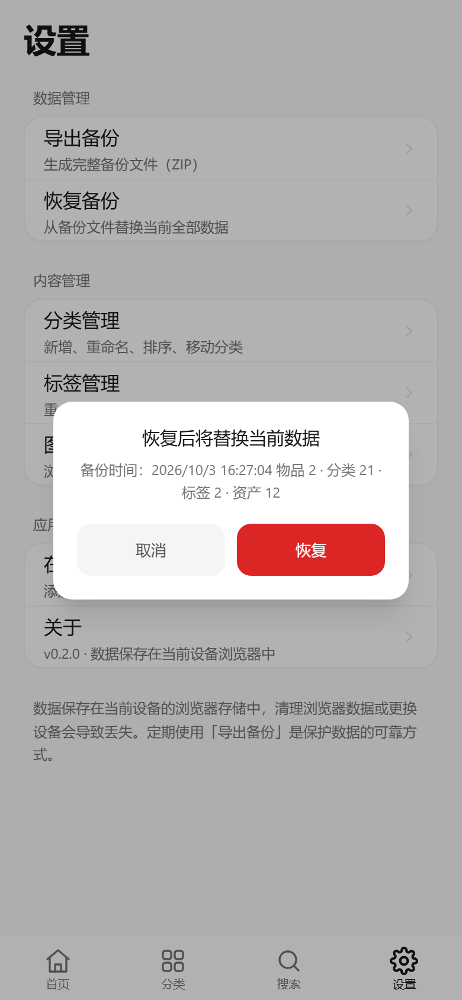
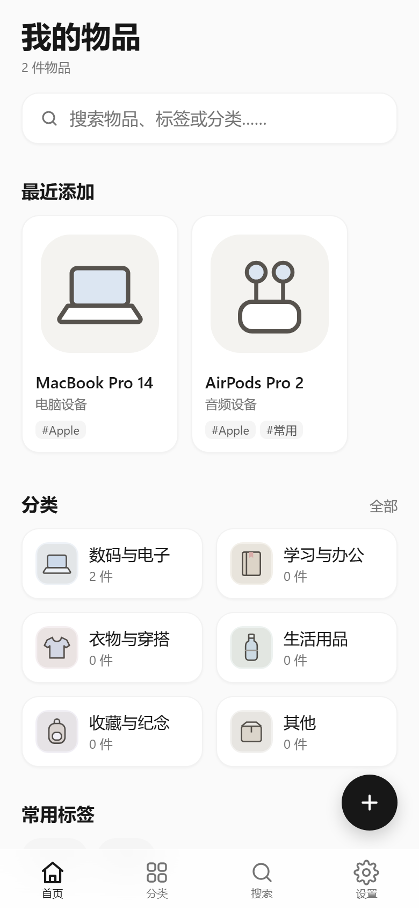

# Private Item Library · 私人数字物品库

一个 **local-first（本地优先）** 的个人物品管理 PWA。所有数据存放在浏览器 IndexedDB 中，**没有后端、没有账号、没有云端同步**——你的物品清单完全属于你自己。

适用于记录数码产品、家电、线缆配件、收藏品等个人物品：通过**分类、标签和搜索**整理与找到自己的物品记录。

> 本项目**不做位置树**（不涉及 room / shelf / storage location 等存放位置维度），定位不是"找东西放在哪个房间哪个格子"，而是把物品记录本身整理清楚、随时可查。

---

## 当前状态

Phase 2C 已完成：应用具备完整的数据管理闭环与离线可用能力。

| 阶段 | 内容 | 状态 |
|---|---|---|
| Phase 0–1 | 竞品调研、许可证核查、架构设计 | ✅ 完成 |
| Phase 2A | UI 原型 · 11 个页面 + 移动端 HIG 精修 | ✅ 完成 |
| Phase 2B | 本地数据层 + 核心 CRUD + 单元测试 | ✅ 完成 |
| Phase 2C | 备份/恢复（ZIP）、PWA 离线安装、CI | ✅ 完成 |

**测试**：85 个单元测试全部通过（domain 纯函数 + repository 集成测试）。
**验证**：备份导出、恢复替换、离线打开、PWA manifest 均已在真实浏览器 + 生产构建上端到端验证。

---

## 技术栈

| 类别 | 选型 |
|---|---|
| 框架 | React 19 + TypeScript 5.9 |
| 构建 | Vite 7 |
| 样式 | Tailwind CSS 3（移动端优先，375 / 390 / 430px 三档自适应） |
| 本地数据库 | Dexie 4（IndexedDB 封装） + dexie-react-hooks |
| 路由 | react-router 7（BrowserRouter） |
| 备份打包 | JSZip（**按需动态加载**，不进入首屏） |
| PWA | vite-plugin-pwa（Workbox `generateSW`） |
| ID | ulid（可排序、URL 安全） |
| 测试 | Vitest + fake-indexeddb |

刻意**不引入**状态管理库、动画库、图表库与任何后端 SDK——这是一个纯前端、少依赖、可长期维护的项目。

---

## 快速开始

```bash
npm install      # 或 npm ci（严格按 package-lock.json 还原）
npm run dev      # 启动开发服务器 http://localhost:5173
npm run build    # 类型检查 + 生产构建
npm run preview  # 预览生产构建（PWA 需在此模式下验证）
npm run test     # 运行测试
npm run typecheck
```

首次启动会为空数据库写入种子数据：**21 个默认分类 + 12 个内置图标**。

> Service Worker 仅在**生产构建**中启用（`npm run build && npm run preview`），开发模式下不注册，避免缓存干扰调试。

---

## 目录结构

```
src/
├── components/     # 通用组件（BottomNav / ItemCard / Dialogs / Toast 等）
├── pages/          # 页面（Home / Categories / Search / Settings 等）
├── features/data/  # useLiveQuery 封装与视图模型
├── db/             # Dexie 实例与 repositories（唯一数据库调用方）
├── domain/         # 纯函数与业务逻辑（搜索打分 / 分类树 / 标签标准化 / 备份校验）
├── services/       # 跨层编排（备份恢复、PWA 能力检测）
├── data/           # 图标注册表
├── mock/           # 演示数据（仅开发环境手动调用）
└── types/
根目录：main.tsx（入口）、App.tsx（路由）、index.css（全局样式与 token）、appInfo.ts（版本号唯一来源）
docs/               # 架构设计、竞品调研、各阶段截图
scripts/            # 图标生成、CDP 驱动的截图与端到端验证脚本
```

分层原则：`domain` 层是纯函数且**全部有测试覆盖**，`db/repositories` 是**唯一**允许直接操作 Dexie 的地方，页面层不接触数据库细节。

---

## 已实现功能

- **物品管理**：新增 / 编辑 / 查看 / 软删除，支持名称、备注、标签与内置图标（**当前仅 preset icon**，尚未支持照片上传）
- **分类树**：最多两级，展开折叠、数量徽标、祖先链计数
- **标签系统**：自动标准化去重，支持合并与重命名
- **搜索**：实时匹配，按名称 / 分类 / 标签加权打分排序，含最近搜索记录
- **管理页面**：分类管理（移动、排序、删除保护）、标签管理、图标库
- **删除保护**：分类非空时禁止删除，软删除（`deletedAt`）保留数据
- **备份与恢复**：导出完整 ZIP 备份，从备份原子替换恢复
- **PWA**：可安装到主屏幕，App Shell 离线可用
- **存储持久化**：启动时尽力申请 `navigator.storage.persist()`

---

## 备份与恢复

### 导出

设置 → 数据管理 → 导出备份，生成 `private-item-library-backup-YYYY-MM-DD.zip`：

```
manifest.json    schemaVersion / exportVersion / exportedAt / 四个计数
data.json        items · categories · tags · itemTags · assets 元数据 · appMeta
assets/          仅真实用户二进制资产（preset 静态图标随包交付，不重复打包）
```

备份**不含任何哈希校验字段**——这是刻意的设计取舍：备份的价值在于可恢复，而非密码学防篡改。

### 恢复

设置 → 数据管理 → 恢复备份，选择 ZIP 后：

1. **解析与校验**（此阶段**完全不触碰数据库**）
   — ZIP 可读、`manifest.json` 与 `data.json` 存在、`schemaVersion` 受支持、必需字段存在且类型正确
2. **展示摘要**并明确提示「恢复后将替换当前数据」
3. 用户确认后，在**单个 Dexie transaction** 中完整替换

任何一步失败都会**拒绝导入并保持当前数据库完全不变**，不会出现"清空一半后失败"的中间状态。第一版仅实现 **Replace Restore**，不做合并。

---

## 安装到手机

### iPhone / iPad

1. 使用 **Safari** 打开本页面
2. 点击底部「分享」按钮
3. 向下滚动，选择「添加到主屏幕」

已从主屏幕启动时，设置页会显示「已从主屏幕运行」。本项目不会尝试自动触发 iOS 安装弹窗（iOS 不支持该能力）。

### Android / 桌面 Chrome

浏览器会自动提示安装，或在地址栏/菜单中选择「安装应用」。

---

## 部署

路由使用 **BrowserRouter**（URL 干净，无 `#`）。因此部署平台**必须配置 SPA fallback**，把所有未知路径回落到 `index.html`，否则直接访问 `/items/:id`、`/categories/:id`、`/search` 会得到 404。

```toml
# Netlify — netlify.toml
[[redirects]]
  from = "/*"
  to = "/index.html"
  status = 200
```

```json
// Vercel — vercel.json
{ "rewrites": [{ "source": "/(.*)", "destination": "/index.html" }] }
```

```nginx
# nginx
location / {
  try_files $uri $uri/ /index.html;
}
```

> GitHub Pages 不支持服务端 rewrite，需额外提供 `404.html` 拷贝 `index.html` 的方案，或改用 Netlify / Vercel / Cloudflare Pages。

Service Worker 的 `navigateFallback` 已配置为 `/index.html`，因此在**已缓存**的情况下，离线访问任意路由同样可以打开。

---

## 界面预览

Phase 2B · UI 原型

| 首页 | 分类 | 搜索 |
|---|---|---|
|  |  |  |

| 新增物品 | 物品详情 | 设置 |
|---|---|---|
|  |  |  |

Phase 2C · 备份恢复与离线验证

| 恢复确认 | 恢复后 | 离线打开 |
|---|---|---|
|  |  |  |

更多截图见 [`docs/screenshots/`](docs/screenshots/)（含 Phase 2B 真实数据流程验证）。

---

## 数据说明

Dexie Schema v1 共 6 张表：

```ts
db.version(1).stores({
  items:      'id, categoryId, name, createdAt, updatedAt, deletedAt',
  categories: 'id, parentId, name, sortOrder, deletedAt',
  tags:       'id, &nameNormalized, createdAt',
  itemTags:   '[itemId+tagId], itemId, tagId',
  assets:     'id, kind, createdAt',
  appMeta:    'key',
})
```

数据仅保存在**当前设备当前浏览器**中。应用会在启动时尽力申请持久化存储，但这只是一项偏好请求：浏览器可以拒绝，用户清理浏览数据时依然会被清除。

**定期导出备份是保护数据的可靠手段。**

---

## 持续集成

`.github/workflows/ci.yml` 在每次 push 与 PR 时执行 `npm ci` → `npm run test` → `npm run build`，确保主分支始终处于可构建、测试通过的状态。

---

## License

未提供开源许可证，保留所有权利。
