# Private Item Library · 私人数字物品库

一个 **local-first（本地优先）** 的个人物品管理 PWA。所有数据存放在浏览器 IndexedDB 中，**没有账号体系**——你的物品清单完全属于你自己。数据始终先写本机，保存后不依赖任何网络。唯一可选的出网能力是自己部署的同步 Worker（见下方云端同步章节），不接入任何第三方账号或云服务。

可选地开启**私人云端同步**（Phase 3B，默认关闭）：数据会镜像到你自己独占的 Cloudflare D1，用于**换机恢复**，也可以连接其他设备。它需要你自己部署，不接入任何第三方账号体系。

通过**分类、标签、搜索与 156 个内置物品图标**整理与找到自己的物品记录；支持**浅色 / 深色 / 跟随系统**三态主题，可安装到手机主屏并离线使用。

物品有完整的**心愿 → 持有 → 处置**生命周期：心愿可转为持有并补齐购买信息；持有的物品可出售 / 丢弃 / 其他处置；出售后自动算出**实际持有成本**（可为负，代表卖出时实际赚了钱）。

> 本项目**不做位置树**（不涉及 room / shelf / storage location 等存放位置维度），定位不是"找东西放在哪个房间哪个格子"，而是把物品记录本身整理清楚、随时可查。

---

## 界面预览（Phase 2H）

<table>
<tr>
<td width="50%">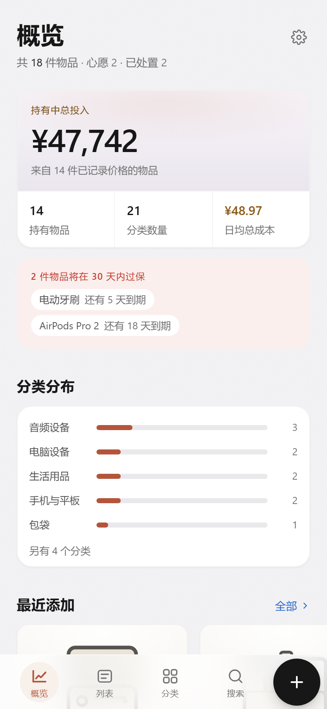</td>
<td width="50%">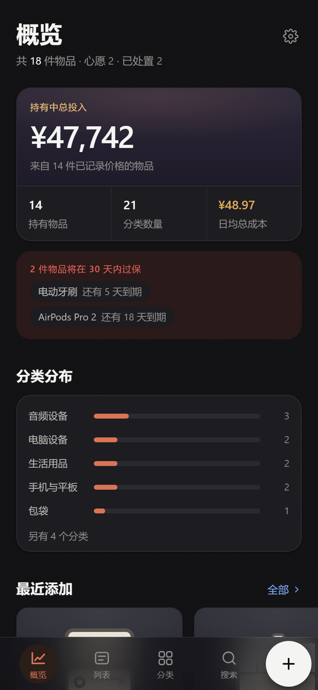</td>
</tr>
<tr>
<td align="center"><sub>概览 Dashboard · Hero 材质主锚点 + 信息分组</sub></td>
<td align="center"><sub>概览 Dashboard · 深色（独立调校的材质系统）</sub></td>
</tr>
<tr>
<td>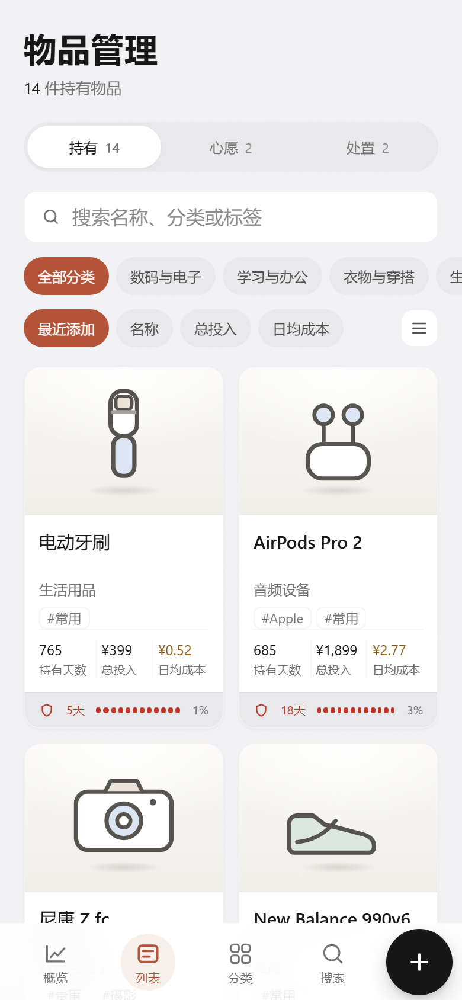</td>
<td>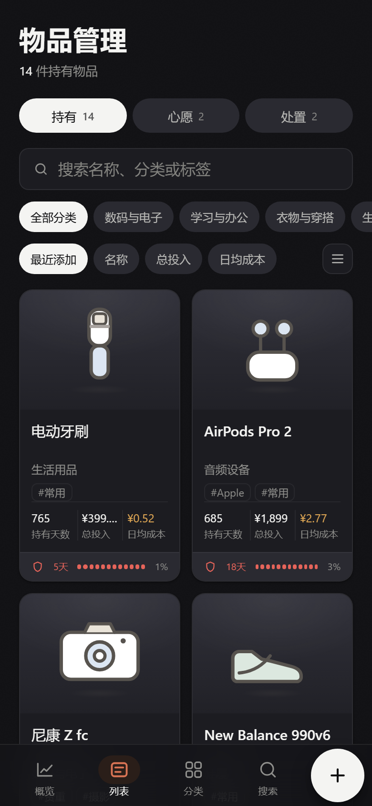</td>
</tr>
<tr>
<td align="center"><sub>物品列表 · 网格卡 + 保修进度条</sub></td>
<td align="center"><sub>物品列表 · 深色</sub></td>
</tr>
<tr>
<td>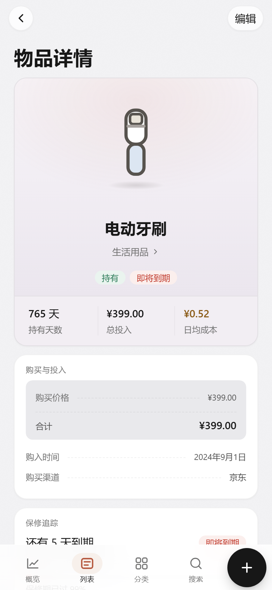</td>
<td>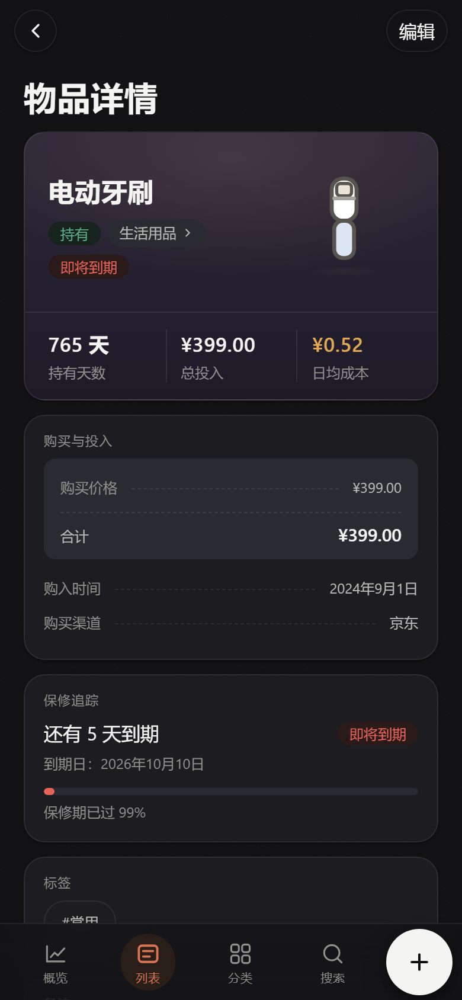</td>
</tr>
<tr>
<td align="center"><sub>物品档案 · Large Title + 横向 Hero 身份卡 + Grouped Sections</sub></td>
<td align="center"><sub>物品档案 · 深色 Hero（更深更饱和的同一套材质）</sub></td>
</tr>
<tr>
<td>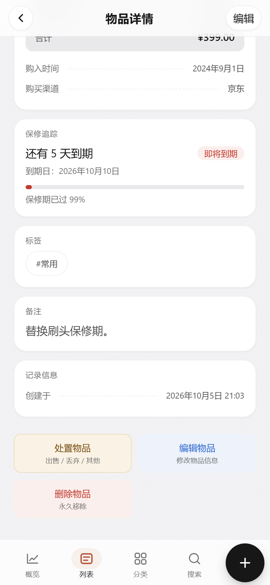</td>
<td>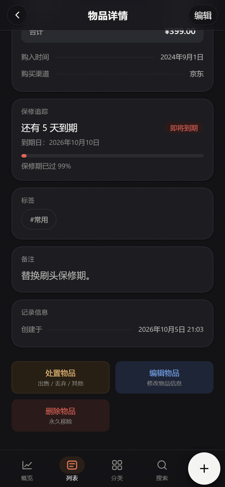</td>
</tr>
<tr>
<td align="center"><sub>滚动后 Compact Header（居中小标题 + chrome 材质）</sub></td>
<td align="center"><sub>生命周期操作 · 图标 + 标题 + 副标题 + 语义 tint</sub></td>
</tr>
<tr>
<td>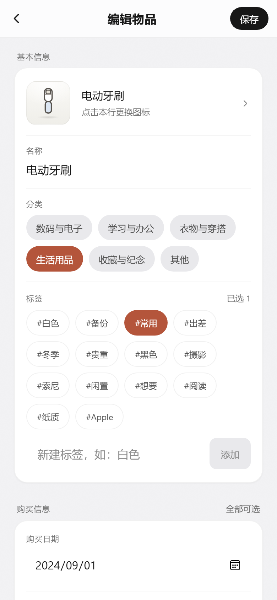</td>
<td>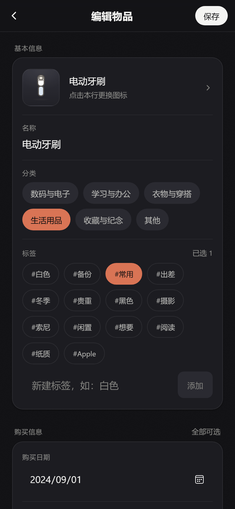</td>
</tr>
<tr>
<td align="center"><sub>编辑页 = 详情页的编辑态（同一套分组语言）</sub></td>
<td align="center"><sub>编辑页 · 深色</sub></td>
</tr>
<tr>
<td>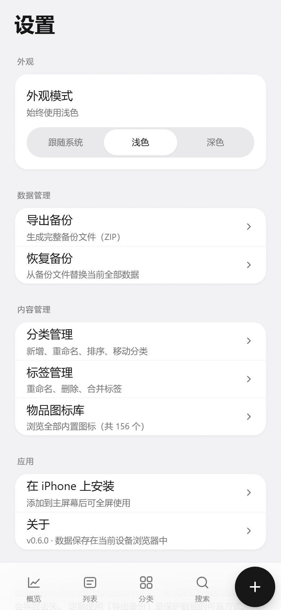</td>
<td>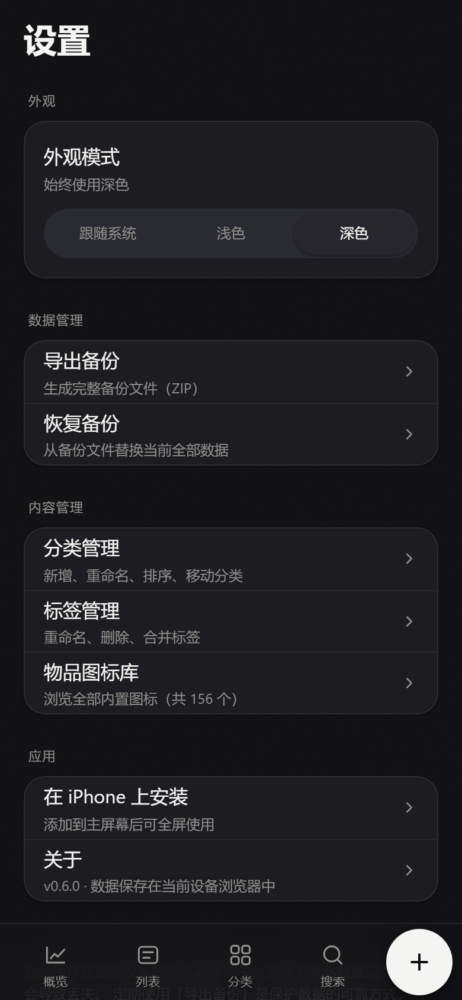</td>
</tr>
<tr>
<td align="center"><sub>设置 · 外观模式（与列表页共用同一分段控件）</sub></td>
<td align="center"><sub>设置 · 深色</sub></td>
</tr>
</table>

> 以上均为**真实浏览器**（无头 Edge + CDP）渲染截图，未做任何修饰。浅色与深色**成对验证**；历史阶段截图见文末。

---

## 当前状态

**当前稳定版本：`1.0.0`**（首个正式稳定版 · 版本号唯一来源是 `src/appInfo.ts` 的 `APP_VERSION`；设置 → 关于页可读，改版本需同步 `package.json` 与 `package-lock.json`）

| 阶段 | 版本 | 内容 | 状态 |
|---|---|---|---|
| Phase 0–1 | — | 竞品调研、许可证核查、架构设计 | ✅ 完成 |
| Phase 2A | 0.1.0 | UI 原型 · 11 个页面 + 移动端 HIG 精修 | ✅ 完成 |
| Phase 2B | 0.2.0 | 本地数据层 + 核心 CRUD + 单元测试 | ✅ 完成 |
| Phase 2C | 0.3.0 | 备份/恢复（ZIP）、PWA 离线安装、CI | ✅ 完成 |
| Phase 2E | 0.3.0 | 购买信息（日期 / 价格 / 附加花费 / 平台）与日均使用成本 | ✅ 完成 |
| Phase 2F | 0.4.0 | 物品图标体系（12 → 73）、图标选择器、三态主题、preset 资产幂等同步、整体视觉精修 | ✅ 完成 |
| Phase 2G | 0.5.0 | 导航重构（4 Tab + 独立 +）、概览 Dashboard、完整物品列表、**心愿→持有→处置生命周期**、出售金额与实际持有成本、保修追踪、图标 73 → 156 | ✅ 完成 |
| Phase 2H | 0.6.0 | 视觉系统精修：MarkItem-inspired + award-winning iOS design study —— 明暗两套独立材质、Hero Surface、Large Title → Compact Header、Grouped Sections、列表卡片与编辑体验重做 | ✅ 完成 |
| Phase 2H.1 | 0.6.1 | PWA 更新体验修复：主动 SW update check、前台恢复检查、表单期间绝不 reload、安全自动更新、设置页「检查更新」 | ✅ 完成 |
| **Phase 3B** | **0.7.0** | **可选的私人云端同步**（Cloudflare Workers + D1）：本地优先不变，云端只存同步状态与数据镜像；含 outbox、revision 协议、tombstone 单调性、冲突记录、tag 跨设备去重 | ✅ 完成 |
| **Phase 3B.1** | **0.7.0** | **主力手机场景细化**：本地保存后自动后台同步（2.5s debounce）、产品语义改为「云端同步」、Pairing Code 明确为**恢复码**（换机 / 清数据后靠它连回云端）、新设备以云端为准恢复 | ✅ 完成 |
| **Stable Release** | **1.0.0** | 核心功能、视觉系统、离线 PWA、备份恢复与可选私人云同步完成稳定性收口，作为首个正式稳定版本 | ✅ 正式版 |

**测试**：**657** 个单元测试全部通过（**39** 个文件）。覆盖 domain 纯函数 + repository 集成 + 主题逻辑 + 图标元数据 + 生命周期与成本口径 + 数据库迁移 + 备份兼容 + PWA 更新决策 + **PWA 图标资产契约（五个 target 与生成器 targets 表一致、输入源是唯一一张母版、无双轨残留、maskable 与 any-512 逐字节一致、index.html / manifest 引用路径有效、旧文件名已消失）** + **同步引擎（假云端端到端：push/pull 收敛、tombstone 不被复活、outbox 回声防护、tag 去重）** + **Worker 装配层（真 node:sqlite 驱动 `executePush`：bind 参数逐位对应、整批事务、tag 并发冲突后重试、`revision_seq == MAX(revision)` 不变量）** + **local-change 自动同步（debounce 聚合、关闭/离线零网络、恢复码不进 ZIP、换机恢复）**）。
**验证**：底栏结构 / 设置齿轮 / 三态切换 / 列表筛选排序 / 处置 Sheet / 保修提醒 / 负成本格式化 / 备份导出与恢复替换 / 旧备份迁移 / 离线打开 / 深色首帧无白闪 / 主题切换过渡 / 桌面与移动响应式，均已在真实浏览器 + 生产构建上端到端验证（共 **175** 项自动化断言：Phase 2G 45 · 视觉与交互 50 · 管理页 9 · 生产与离线 8 · Phase 2H 32；生产冒烟 8/8；**Phase 2H.1 PWA 更新端到端 23/23** · **App Icon 端到端 22/22（双母版）** · **单一正式图标端到端 22/22**）。驱动脚本是本地开发工具（无头 Edge + CDP），不随仓库分发。

## v1.0.0 · 第一正式稳定版

本项目从 0.x 开发阶段进入**首个正式稳定版本**。这一版没有新增功能，收口的是核心链路与稳定性。

1. **核心物品管理已完整**：心愿 → 持有 → 处置三态闭环，含「转为持有」「处置物品」「恢复为持有」。
2. **处置支持出售 / 丢弃 / 其他**。出售后展示出售回收、总投入、**盈亏**与日均成本，口径已统一；
   丢弃 / 其他不伪造出售金额与盈亏。
3. **已处置物品有独立语义**：`sold` 走净成本与盈亏（盈利 / 亏损 / 持平），`discarded` / `other`
   不编造金额；「出售但没填金额」也不计算盈亏——它不等于「出售 0 元」。
4. **数据仍然 local-first**：任何保存首先写本机 IndexedDB，**保存不依赖网络成功**。
5. **私人云端同步是可选功能，默认关闭**：Cloudflare Workers + D1，用于多设备与换机恢复。
6. **备份独立存在**：ZIP 备份 / 恢复照旧可用，**同步 ≠ 备份**，恢复码绝不进 ZIP。
7. **PWA 可离线安装**，有主动更新检测，且**编辑期间不会强制 reload**。
8. **视觉收口**：Phase 2H 设计系统 + 156 个物品图标 + 新的 **Archive Box** App Icon + 明暗主题。

> 详见下方各章节：Dexie 仍为 **v4**、备份 `schemaVersion` 仍为 **3**——**这些与 APP_VERSION 无关**，
> 本次发布**没有改动任何数据库 schema、同步协议或备份格式**。

> **Phase 3B 说明**：同步是**可选功能，默认关闭**。业务数据 100% 存本地 IndexedDB，云端只作为"远端镜像 + 换机恢复"的用途。Worker 侧的写入路径经四轮审查（含真SQLite 装配层测试与变异验证），数据库 Schema 已冻结。完整设计与逐轮审查记录见 [`docs/PHASE_3B_IMPLEMENTATION_PLAN.md`](docs/PHASE_3B_IMPLEMENTATION_PLAN.md)。

> **Phase 2H 说明**：本轮是设计升级，学习目标来自竞品拆解（MarkItem 的视觉与层级原则）、Apple Design Awards 2025/2026 获奖与入围 App（Moonlitt / Tide Guide / Structured / Play / Vocabulary / Mela / Speechify / Guitar Wiz）以及 Apple HIG。**不复制任何竞品的品牌、图标、文案或业务字段**，也**没有引入容器系统、总价值、多货币、数量、Timeline Event 库**等无产品价值的功能；完整拆解与决策过程见 [`docs/PHASE_2H_DESIGN_AUDIT.md`](docs/PHASE_2H_DESIGN_AUDIT.md)。数据库 Schema 未改动，用户数据 100% 兼容。

**Phase 2H 第二轮补记**（复看竞品截图后发现并修掉的问题）：

| 问题 | 修法 |
|---|---|
| Hero 是竖排海报、指标掉到白色卡片区，密度和"一整块身份"感偏弱 | 改为**横向身份卡**：名称/状态/分类 chip 在左、物品图在右，三栏指标收进同一块染色区（`hero-surface` 铺满整卡，渐变连续无接缝） |
| 生命周期操作只有两行文字，右侧空一大片 | 改为「**图标 + 标题 + 副标题**」左对齐块，配低饱和语义 tint |
| 列表页状态切换自造了一套深色药丸，与设置页外观模式不像同一控件 | 复用全站**唯一**的 `SegmentedControl`（iOS 浅轨道 + 抬起滑块），并给它加了计数 hint |
| 底栏选中态只给图标加底，文字不变 | 改为**包住图标 + 文字的整枚胶囊** |
| 网格卡「总投入」被截成 `¥399....` | 新增 `formatCentsCard`：整元省两位小数，非整元**绝不四舍五入** |
| 深色下选中态翻成刺眼白底黑字（`ink-solid` 在深色是浅色实心块） | 全部选中态改用 `bg-accent text-ink-inverse`；主操作 CTA 保留 `ink-solid` |

### 浏览器测试隔离

浏览器验证必须使用项目内置的隔离启动器，不得使用日常 Edge Profile。启动和停止示例：

```powershell
npm run browser:start -- --port=9222
node scripts/verify.mjs
npm run browser:stop -- --port=9222
```

启动器把测试 Profile 放在 `.tmp`，并关闭同步、扩展、首次运行导入和组件更新；它不会登录 Microsoft 账户。停止时只按 PID 关闭该测试浏览器，禁止使用 `taskkill /IM msedge.exe`。完整规则见 [`AGENTS.md`](AGENTS.md) 和 [`BROWSER_TESTING.md`](BROWSER_TESTING.md)。

---

## 技术栈

| 类别 | 选型 |
|---|---|
| 框架 | React 19 + TypeScript 5.9 |
| 构建 | Vite 7 |
| 样式 | Tailwind CSS 3，颜色/阴影全部指向 CSS 语义变量（`--color-*`） |
| 本地数据库 | Dexie 4（IndexedDB 封装） + dexie-react-hooks |
| 路由 | react-router 7（BrowserRouter） |
| 备份打包 | JSZip（**按需动态加载**，不进入首屏） |
| PWA | vite-plugin-pwa（Workbox `generateSW`） |
| ID | ulid（可排序、URL 安全） |
| 同步（可选） | Cloudflare Workers + D1，Wrangler 4（`wrangler.jsonc`；绑定名 `SYNC_DB`） |
| 测试 | Vitest + fake-indexeddb + node:sqlite（Worker 侧用真 SQLite 验证事务原子性） |

刻意**不引入**状态管理库、动画库、图表库、UI 组件库与任何后端 SDK——除了**可选的云端同步**（Phase 3B，纯标准 fetch + 自建 Worker，无第三方 SDK）。这是一个少依赖、可长期维护的项目。

---

## 快速开始

```bash
npm install      # 或 npm ci（严格按 package-lock.json 还原）
npm run dev      # 启动开发服务器 http://localhost:5173
npm run build    # 类型检查 + 生产构建
npm run preview  # 预览生产构建（PWA 需在此模式下验证）
npm run test     # 运行测试
npm run typecheck
node scripts/gen-item-icons.mjs   # 重新生成全部物品图标（唯一生成入口）
npm run icons                    # 重新生成 PWA App Icon（唯一生成入口）
```

首次启动会为空数据库写入种子数据：**21 个默认分类 + 156 个内置物品图标**。
已用过的数据库会在每次启动时**幂等补齐**新增图标（见下方「物品图标系统」），无需重置。

> Service Worker 仅在**生产构建**中启用（`npm run build && npm run preview`），开发模式下不注册，避免缓存干扰调试。

---

## 主题系统

设置 → 外观 → **外观模式**：`跟随系统` / `浅色` / `深色`（分段控件，非原生下拉）。默认跟随系统，选择持久保存在 `localStorage`。

### 语义色 token

所有颜色定义在 `src/index.css` 的两套变量里，`tailwind.config.js` 的调色板与阴影**全部指向 `var(--color-*)`**：

```css
:root, [data-theme='light'] { --color-canvas: #f2f2f4; --color-surface: #fff; /* … */ }
[data-theme='dark']         { --color-canvas: #101013; --color-surface: #1c1c21; /* … */ }
```

因此组件只表达意图（`bg-surface` / `text-ink-primary` / `border-line`），**全站没有任何 `dark:` 变体**。深色模式是一套**独立设计的主题**，而不是浅色的颜色反转。Phase 2H 重新校准了明度分层（iOS grouped interface 三级结构）——页面底明显比卡片沉一档，卡片不再靠阴影硬撑：

| 分层 | 浅色 | 深色 | 作用 |
|---|---|---|---|
| `canvas` | `#F2F2F4` | `#101013` | 页面底（冷灰 / 深灰，与卡片拉开明度差） |
| `surface` | `#FFFFFF` | `#1C1C21` | 分组卡 / 列表行 |
| `surface-raised` | `#FFFFFF` | `#26262C` | 浮层 / 对话框 |
| `surface-sunken` | `#E9E9EC` | `#2A2A31` | inner cell / 未选胶囊 |
| `hero`（top→bottom） | `#F7F4F8` → `#EBE6EE` | `#2D2839` → `#1E1A28` | **物品身份卡专属材质**（暖 plum tint + 陶土微光） |
| `plate` | `#F5F4F0` | `#26262C` | 物品展台底衬 |
| `ink` primary→faint | `#171717` → `#8C8C8C` | `#F4F4F2` → `#83837F` | 文字四级 |
| `line` / `line-strong` / `line-inner` | 低对比 hairline | 低对比 hairline | 结构线 |

Hero 是 Phase 2H 新增的**独立层级**：`.hero-surface` 打光配方 + `--color-hero-*` / `--hero-glow` token，浅色是极淡的暖 plum，深色是更深更饱和的对应色——"同一信息架构，两套独立调过的材质"的样板，颜色绝不硬编码进页面。

**语义色有五个**，刻意不铺彩虹：

| Token | 用途 |
|---|---|
| 陶土 `accent` | 品牌与交互：选中态、导航指示 |
| 蓝 `info`（Phase 2H 新增） | **普通交互**：清除 / 设置 / 查看全部 / 编辑入口 —— 系统蓝风格但降饱和以适配暖色品牌 |
| 绿 `success` | 保修中 / 恢复为持有 |
| 琥珀 `money` | 价格 / 总投入 / 日均成本 —— 数据指标不该和"可交互"共用同一种颜色 |
| 红 `danger` | 删除等危险操作 |

### 首帧不闪白

深色偏好下启动 PWA 不能先闪一整屏白。`index.html` 里有一段**内联同步脚本**，在 React mount 之前就完成：

```
localStorage['pil.theme'] + window.matchMedia('(prefers-color-scheme: dark)')
  → document.documentElement.dataset.theme
  → <meta name="theme-color"> 同步（iOS / PWA 状态栏随之变深）
```

该脚本的常量与 `src/theme/theme.ts` 由测试断言保持一致，防止两边脱节。

### 跟随系统是实时的

`matchMedia('(prefers-color-scheme: dark)')` 的 `change` 事件直接驱动重渲染——系统切到夜间模式时网页**当场变化**，不需要刷新。切换瞬间会给可见表面挂上 `html.theme-shift` 做 220ms 颜色过渡（不使用 `*` 选择器，避免上百元素同时 transition 掉帧）。

---

## 主导航

底部只有 **4 个 Tab + 1 个独立的「+」**，设置**不在 Tab 里**：

```
┌──────────────────────────────────────┐
│  概览   列表   分类   搜索     (+)    │   ← + 圆钮独立在右端，不占 Tab 位
└──────────────────────────────────────┘
```

| 路由 | 页面 | 说明 |
|---|---|---|
| `/` | **概览 Dashboard** | 总投入、保修提醒、分类分布、最近添加；**右上角齿轮**进入设置 |
| `/items` | **物品列表** | 持有 / 心愿 / 处置分段 + 搜索 + 筛选 + 排序 + 双视图 |
| `/categories` | 分类 | 两级分类树 |
| `/search` | 搜索 | 实时加权搜索 |
| `/items/new` | 新增物品 | 由「+」进入 |
| `/items/:id` `/items/:id/edit` | 详情 / 编辑 | — |
| `/settings` | 设置 | **从概览页右上角齿轮进入**，路由不变 |
| `/settings/categories` `/settings/tags` `/settings/icons` | 管理页 | — |

「+」是**比普通 Tab 更醒目的圆形按钮**，嵌在导航条右端（不是浮在上方的独立 FAB）。四个普通 Tab 均分左侧剩余宽度。选中态是**包住图标 + 文字的一枚胶囊**（陶土淡底 + 陶土字），图标与标签同时变色——只给图标加底会让"选中"这件事少一半信号。安全区（`env(safe-area-inset-bottom)`）、半透明 chrome、`prefers-reduced-transparency` 降级、桌面取景框对齐全部保留。

> 本项目**刻意不做「容器」Tab，也不做「日历」Tab**：容器会与"不维护位置树"的产品定位冲突；日历在保修/时间功能足够复杂之前不值得占一个主导航位。

---

## 物品图标系统

### 156 个内置图标，9 个分类

`数码 54 · 服饰 19 · 兴趣 19 · 生活 16 · 厨房 14 · 家居 12 · 护理 10 · 办公 9 · 其他 3`

Phase 2G 新增 **83** 个，并开出「护理」「厨房」两个新分类，聚焦真实个人物品场景：电动牙刷 / 空气炸锅 / 吹风机 / 帐篷 / 哑铃 / 插线板 / 螺丝刀 / 移动 SSD / 拓展坞 ……

`phone`（手机）与 `tablet`（平板电脑）是两个**独立**图标，另设 `ereader`（电子书阅读器）等细分类目。

全部图标由 **`scripts/gen-item-icons.mjs`** 生成——这是唯一入口，改完跑一次即全量重建，**不要手改 `public/icons/items/*.svg`**：

- 统一 96×96 画布、统一描边 `#57534E`、统一调色板
- **透明背景**；底衬由 CSS 的 `--color-plate` 提供，因此**一套资源深浅主题通用**
- 整体内缩 0.86：宽扁物体（显示器、路由器、数据线）不会顶到圆角边缘
- 底部径向渐变接触阴影：实心椭圆在浅底上会读成"一块灰斑"而不是影子

### 图标选择器

`物品图标`元数据为 `key / label / path / category / keywords`，因此**按日常叫法就能搜到**：

| 输入 | 命中 |
|---|---|
| `平板` / `iPad` / `iPad Pro` | 平板电脑 |
| `电动牙刷` | 电动牙刷 |
| `插线板` | 插线板 |
| `充电头` | 充电器 |
| `话筒` | 麦克风 |
| `电脑` | 笔记本电脑 · 台式电脑 · 平板电脑 |

选择器提供 **搜索 / 最近使用 / 分类 / 完整网格** 四层结构（`src/components/IconPickerSheet.tsx`）。「最近使用」存 `localStorage`，上限 8 个。表单页只显示当前选中的那一个大图标 + 名称 + 「更换图标」，**不会把 150+ 图标铺在表单里**。

### 老数据库如何自动拿到新图标

`seedIfEmpty()` 只在**真正空库**时写入一次——这意味着已用过的设备永远拿不到之后新增的图标。因此启动闸里额外调用 **`syncPresetAssets()`** 做幂等同步：

| 契约 | 实现 |
|---|---|
| 不清空用户数据 | 只读 `kind === 'preset'`，其余表不进事务 |
| 不要求重置数据库 | 每次启动自动执行 |
| 不删除用户已有 Asset | **只新增与就地更新，从不删除**（已下线图标的资产也保留，历史 `Item.iconAssetId` 可能仍在引用） |
| 不破坏 `Item.iconAssetId` | **完全不写 `items` 表** |
| 已存在 preset 不重复创建 | 按 `preset-<key>` 幂等 upsert |
| path / metadata 可安全更新 | 就地更新但**保留原 `createdAt`** |
| 非 preset 资产不受影响 | `ai_generated` / `from_photo` 完全不参与 |
| 备份 / 恢复不损坏 | preset 是包内静态资源，不进 ZIP 的 `assets/`；恢复后下一次启动会再次补齐 |

`src/db/presetSync.test.ts` 为上述每一条都写了断言。

---

## 已实现功能

- **物品管理**：新增 / 编辑 / 查看 / 软删除，支持名称、备注、标签与 156 个内置图标（**当前仅 preset icon**，尚未支持照片上传）
- **生命周期**：心愿 → 持有 → 处置三态，含「转为持有」「处置物品」「恢复为持有」
- **完整物品列表** `/items`：持有 / 心愿 / 处置分段 + 搜索 + 分类筛选 + 四种排序 + 网格/列表双视图
- **概览 Dashboard**：持有中总投入、三项关键指标、30 天内过保提醒、分类分布、最近添加、累计出售回收
- **保修追踪**：记录保修到期日，自动判定「保修中 / 即将到期（30 天内）/ 已过保」
- **分类树**：最多两级，展开折叠、数量徽标、祖先链计数
- **标签系统**：自动标准化去重，支持合并与重命名
- **搜索**：实时匹配，按名称 / 分类 / 标签加权打分排序，含最近搜索记录
- **图标选择器**：搜索 + 最近使用 + 九分类网格（见上方章节）
- **外观设置**：跟随系统 / 浅色 / 深色，实时切换并持久化
- **管理页面**：分类管理（移动、排序、删除保护）、标签管理、物品图标库
- **删除保护**：分类非空时禁止删除，软删除（`deletedAt`）保留数据
- **购买信息**：记录购买日期 / 价格 / 附加花费 / 平台，自动算出**总投入**与**日均使用成本**
- **出售与净成本**：出售 / 丢弃 / 其他三种处置方式；出售后按「总投入 − 出售金额」计算**实际持有成本**
- **备份与恢复**：导出完整 ZIP 备份，从备份原子替换恢复
- **云端同步（可选，默认关闭）**：保存后自动后台同步（2.5s 聚合），支持换机恢复；详见下方章节
- **已处置物品语义**：`sold` 展示出售回收 / 总投入 / **盈亏**（盈利 / 亏损 / 持平）/ 日均成本；`discarded` / `other` 不伪造金额
- **PWA**：可安装到主屏幕，App Shell 离线可用；主屏图标为 **Archive Box**（收纳档案盒）
- **存储持久化**：启动时尽力申请 `navigator.storage.persist()`

---

## 界面与视觉系统

- **明暗两套独立调校的材质系统**（Phase 2H）：canvas / surface / sunken 三级明度差按 iOS grouped interface 重新校准；深色"抬升"而非"变灰"，一眼能分辨页面、卡片、内部控件与悬浮 Chrome
- **Hero Surface 是独立层级**（Phase 2H）：`.hero-surface` 专属打光（暖 plum tint + 陶土微光）铺满整卡；卡片是**横向身份卡**——名称 / 状态 / 分类 chip 在左、物品图在右，三栏指标收在**同一块染色区**内（不另起白色底），因此渐变连续、没有接缝
- **生命周期操作是「图标 + 标题 + 副标题」块**（Phase 2H）：2×2 网格，每块带 18px 线性图标 + 两行文字 + 低饱和语义 tint（success / money / info / danger），而不是两行孤零零的文字
- **Large Title → Compact Header**（Phase 2H）：详情页进入时是大标题，滚动后由 IntersectionObserver 折叠为居中小标题 + chrome 毛玻璃条，两个标题从不同时可见；不依赖动画库，`prefers-reduced-motion` 自然降级
- **全站唯一分段控件**（Phase 2H）：设置页的外观模式、列表页的生命周期切换共用 `SegmentedControl`（轨道 + 抬起滑块），同一控件不允许在两处长成两副样子；底栏选中态是**包住图标 + 文字的整枚胶囊**
- **Grouped Sections**（Phase 2H）：详情页与编辑页统一为「section 卡 + sunken inner cell + hairline 分隔」，字段不再各自成卡；详情页信息分四层优先级（是谁 → 花了多少钱 → 购买/保修/分类/标签 → 操作）
- **编辑页 = 详情页的编辑态**（Phase 2H）：同 header、同分组、同圆角、同 token；底部「保存更改」主操作 + 「取消编辑」次操作，危险操作不进表单
- **保修进度条**（Phase 2H）：网格卡底部的纯 CSS 分段条（已流逝 = warning/danger 调，剩余 = success），带剩余天数与百分比；只有真正有保修数据的持有物品才渲染，无保修卡片零空白
- **物品展台只有一套打光配方**（`plate-surface` + `--plate-*`）：顶光 + 底部微沉，**不是每张卡片随机渐变**，整页光线才一致
- **Hero 措辞按状态切换**：持有中是「持有天数 / 总投入 / 日均成本」；已出售才用「**实际**持有天数 / **实际**持有成本 / **实际**日均成本」。不该给还在用的物品扣上「实际」二字
- **数字不重复出现**：Hero 只给结论（持有天数 / 总投入 / 日均成本），明细表只给构成（购买价格 / 附加花费 / 合计）
- **字距按文字脚本区分**：CJK 是方块字、自带左右边距，标题用**微开**字距；负字距只留给等宽数字
- **卡片用等高 grid 而非瀑布流**：等高才能让三栏数字横向对齐比较，也保住"最近添加"的时间顺序可预期性
- **语义色只有五个**：accent（品牌/选中）、info（普通交互）、success（保修中）、money（价格/成本）、danger（删除）。其余色刻意不铺——没有语义的状态上色就是彩虹 UI
- **选中态一律用 `bg-accent`**（筛选 chip、分类/平台/状态选择、标签多选、图标分类）：`ink-solid` 在深色下是**浅色**实心块，用它做选中态会让深色页面出现刺眼白底；反过来 `accent + ink-inverse` 在两种主题下都是"品牌色实心块 + 反色字"，语义一致
- **卡片金额用 `formatCentsCard`**：整元省略两位小数（`¥399`），非整元**绝不四舍五入**（仍是 `¥57.14`）——网格卡一栏只有 ~40px，被截成 `¥399....` 比模糊更糟
- **概览是 Dashboard 而非企业后台**：一个 Hero 材质的主数字锚点（持有中总投入）+ 三格指标 + 提醒 + 分类分布 + 最近添加，全部由真实数据推导，无数据整块消失
- **响应式**：`--shell-max` 单一来源控制外壳宽度（430 / 520 / 600px），配合网格列数与图标库列数逐级升档，而不是把手机界面横向拉长
- **动效短且有方向感**：`fade-rise 340ms` / `pop-in 280ms` / `sheet-up 320ms` / 抽屉 `340ms`；全部由 `prefers-reduced-motion` 门控
- **无障碍降级齐备**：`prefers-reduced-transparency`（毛玻璃降级为实色）、`prefers-contrast`、`prefers-reduced-motion`；125% / 150% 浏览器缩放下无横向溢出（真实浏览器验证）

---

## PWA App Icon（Archive Box · 单一正式图标）

主屏图标为 **Archive Box / 收纳档案盒**——**浅暖灰底**上托着一块深蓝圆角内板，板上是一只浅色收纳盒，
盒中露出分类卡（最前一张为品牌青绿），盒正面有标签槽。

浅暖灰背景（≈244,240,237，R>B 的暖灰）**是设计的一部分**，不是需要裁掉的预览底：
它铺满画布四角，正是为 iOS 自动 Dark treatment 预留的明亮区域——iOS 在深色模式下把整张图整体压暗时，
浅底会变成深灰、内板与盒体的层次仍在。

本项目采用**单一正式图标**方案（已不再是 light/dark 双母版）：

- PWA manifest、maskable、apple-touch-icon、favicon **全部**来自同一张母版；
- 不做 `<link rel="icon" media="(prefers-color-scheme: …)">` 主题图标切换，也不给 iOS 主屏做双版本；
- iOS 若自行对主屏图标施加 dark / tinted 外观，那是**系统行为**，我们接受，不写非标准 hack。

唯一母版：`assets/app-icons/app-icon-master-1254.png`（1254×1254、full-bleed、不透明、无预烘焙圆角、无白边）。
它放在 `assets/` 而**不是 `public/`**：母版只作为生成器的输入，不进构建产物、不进 precache。

> **母版来源（可审计）**：设计交付的定稿是 **1254×1254**，**直接无损转成 PNG 就是母版**——
> 浅暖灰底铺满画布四角（full-bleed）+ 深蓝圆角内板 + 白色收纳盒 + teal 文件卡，全部保持设计原样
> （自检：母版与交付原图**逐像素 md5 一致**）。外层圆角留给 iOS / Android 自己裁，**不预烘焙**；
> 生成器对母版**只做缩放，不做任何绘制**。
>
> ❌ 历史弯路（已纠正并写进测试锁死）：曾把外围浅底用谐波扩散外延成深蓝，得到"蓝色大底 + 深蓝内板"的
> **框套框**，同时吃掉了为 iOS Dark treatment 预留的明亮区域。现在改成别的背景色会直接违反契约测试。

派生尺寸全部由 **`scripts/gen-pwa-icons.mjs`** 从母版**等比例高质量缩放**（分离式 Lanczos3）生成——
这是唯一入口，**不要手改 `public/icons/pwa/*.png`**：

| 文件 | 尺寸 | 用途 |
|---|---|---|
| `pwa-192x192.png` | 192×192 | manifest `purpose: any` |
| `pwa-512x512.png` | 512×512 | manifest `purpose: any` |
| `maskable-512x512.png` | 512×512 | manifest `purpose: maskable`（Android 自适应裁切） |
| `apple-touch-icon-180x180-v4.png` | 180×180 | iOS 主屏图标（`index.html` 的 `apple-touch-icon`） |
| `favicon-32x32.png` | 32×32 | 浏览器标签页图标（单一，不做主题切换） |

### 生成器只做"缩放"，不做"重绘"

这条原则被写成硬校验，任一不满足直接抛错（而不是悄悄产出一张"看起来还行"的图）：

- 母版必须是**正方形**、bit depth 8、非隔行，边长在 512~4096 之间；
- 母版必须**完全不透明**（拒绝透明圆角）；
- 母版四角必须是**同一个连续背景**（`assertFullBleedCorners`，四角色差 ≤ 120）：拒绝人工白边、单角补丁、
  透明圆角；**允许渐变，也允许浅色或深色背景**（浅底是本设计的正式选择）；
- **maskable 安全区自动校验**：**核心主体（盒体 / 卡片）**最大半径必须 ≤ **0.4**（Google maskable 规范）。
  判据是两级的：先以四角中位色定背景、与背景差异大的像素定为内板，再取内板深处中比内板明显更亮的像素
  作为核心主体（这样紧贴内板外缘的软投影不会污染判定）。不满足就报错让人回去改母版，而不是在生成端补白边。
  当前母版实测 **0.3413**，因此 `maskable-512x512.png` 与 `pwa-512x512.png`
  **逐字节相同**——`src/data/pwaIcons.test.ts` 直接断言这一点，将来若要为 maskable 单独缩小构图，
  测试会失败，也就是一次"有意识的决定"；
- 每个文件写盘后**回读校验尺寸**；输出目录里不属于 targets 的 PNG **直接删除**——双图标时代的
  `favicon-light-32x32.png` / `favicon-dark-32x32.png` / `apple-touch-icon-180x180-v2.png` /
  `apple-touch-icon-180x180-v3.png` 就是这样被清掉的。

生成器零依赖（Node 内置 zlib 手写 PNG 解码 / 编码），且确定性（连跑两次输出 md5 一致）。
缩放正确性做过交叉验证：与 Pillow 的 LANCZOS 参考实现逐像素比对，**最大偏差 1/255**。

契约由 `src/data/pwaIcons.test.ts`（**17** 项）锁定：targets 与产物一一对应、输入源是唯一一张母版、
**不存在 light/dark 双轨残留**、`index.html` 恰好一条 favicon（无 `media`）+ 一条 apple-touch-icon、
manifest 三条 icons 全部能在 targets 表里找到。

### apple-touch-icon 的 cache bust

iOS 对 `apple-touch-icon` 的缓存极强，覆盖同名文件往往不生效，因此沿用**带版本的新文件名**：
`apple-touch-icon-180x180-v4.png`（`-v2` / `-v3` 与无版本文件均已由生成器删除）。不追加 query string——
本仓库没有这个惯例。Android / 桌面端的缓存失效由 workbox 的 `revision` 内容哈希承担，无需改名。

> ⚠️ 已经装在 iOS 主屏上的图标**不会**因为换文件而自动更新：删掉旧的主屏快捷方式、从 Safari 重新
> "添加到主屏幕"才会拿到新图标（**浏览器标签页 favicon 会立即更新，不受此限**）。删除主屏快捷方式
> **不等于**清浏览器站点数据，不需要为此清 IndexedDB。

---

## PWA 更新机制（Phase 2H.1）

### 问题与根因

Cloudflare 部署了新版本之后，桌面端刷新即可拿到新版，但 **iPhone 主屏 PWA 可能长时间停留在旧版本**。原因不是缓存没清，而是：

`vite-plugin-pwa` 的 `registerType: 'autoUpdate'` 只负责「浏览器**已经发现**新 SW 之后如何安装接管」。读过插件运行时（`dist/client/build/register.js`）可以确认两件事：

1. autoUpdate 模式下 `updateServiceWorker()` **什么都不做**；
2. 插件**从不主动调用** `registration.update()`。

而 iOS 主屏 PWA 恢复的往往是一个**被挂起的旧页面**，浏览器自己不会立刻去查更新 —— 于是页面一直停在旧版本。本阶段补的就是"客户端主动更新管理"。

### 实现方式

| 环节 | 做法 |
|---|---|
| 注册 | `injectRegister: null` + 应用内 `registerSW({ immediate: true })`，**注册路径唯一**（构建产物中不再有 `/registerSW.js`） |
| 接管时机 | 传入 `onNeedReload`：插件此时**不会**自己 `location.reload()`，改由更新管理器决定何时刷新 |
| 启动检查 | 注册完成后异步 `registration.update()`（不阻塞首屏） |
| 前台恢复 | `visibilitychange` / `pageshow` → 统一走 `requestUpdateCheck(reason)` |
| 网络恢复 | `online` 事件重新检查一次 |
| 节流 | 前台恢复类检查 ≥ 60s 一次；启动、手动、联网恢复忽略节流；没有 `setInterval` 轮询 |
| 缓存穿透 | 先 `fetch(sw.js, { cache: 'no-store' })` 再 `registration.update()` |
| 离线 / 失败 | `navigator.onLine === false` 直接跳过；`update()` 抛错静默降级，不弹"更新失败" |

### 安全更新：SAFE / BLOCKED

**绝不**"发现新版本就无条件 reload" —— 本 App 有表单。

- **SAFE**：没有正在编辑的内容 → 后台完成更新并自动进入新版，用户不需要做任何事（不用清缓存、不用重装）。
- **BLOCKED**：`ItemFormPage`、`DisposalSheet`、`ConvertToOwnedSheet` 打开期间，用 `useUpdateGuard()` 注册"此刻不能刷新" → 只置 `updatePending`，显示轻量提示条「新版本已就绪，完成当前操作后自动更新」（非阻塞、非 alert）。
- 保存 / 离开编辑态 → 守卫解除 → **自动**补上这次更新，不需要用户再点一次。

### 防 reload 循环

只有一条 reload 出口（`applying` 关门），并用 `sessionStorage` 记录最近一次更新触发的刷新时间：15 秒保护窗口内不重复自动刷新 —— 是**延迟**而不是丢弃，窗口过后仍会应用，不会把后续真实新版本永久锁死。

### 程序资源 vs 用户数据

| | 存放位置 | 更新时会发生什么 |
|---|---|---|
| **程序资源**（JS / CSS / 图标） | Cache Storage / Service Worker | 新旧版本替换，旧缓存由 `cleanupOutdatedCaches` 清理 |
| **用户数据**（物品 / 分类 / 标签 / 资产） | **IndexedDB** | **完全不受影响**；Dexie schema 仍是 v4，没有任何 delete / clear / reset |

这两套是独立的：更新缓存不会碰 IndexedDB，用户自己改过的分类、新建的标签、录入的物品在版本升级后原样保留。默认分类只在**首次** seed，版本更新绝不覆盖。

### 设置页

设置 → 应用 → **检查更新**：强制忽略节流检查一次，结果用 toast 反馈（已是最新 / 正在更新 / 待操作完成后更新 / 当前离线）。

---

## 备份与恢复

### 导出

设置 → 数据管理 → 导出备份，生成 `private-item-library-backup-YYYY-MM-DD.zip`：

```
manifest.json    schemaVersion / exportVersion / exportedAt / 四个计数
data.json        items · categories · tags · itemTags · assets 元数据 · appMeta
assets/          仅真实用户二进制资产（preset 静态图标随包交付，不重复打包）
```

备份**不含任何哈希校验字段**——这是刻意的设计取舍：备份的价值在于可恢复，而非密码学防篡改。

### 恢复

设置 → 数据管理 → 恢复备份，选择 ZIP 后：

1. **解析与校验**（此阶段**完全不触碰数据库**）
   — ZIP 可读、`manifest.json` 与 `data.json` 存在、`schemaVersion` 受支持、必需字段存在且类型正确
2. **展示摘要**并明确提示「恢复后将替换当前数据」
3. 用户确认后，在**单个 Dexie transaction** 中完整替换

任何一步失败都会**拒绝导入并保持当前数据库完全不变**，不会出现"清空一半后失败"的中间状态。第一版仅实现 **Replace Restore**，不做合并。

---

## 云端同步（可选 · Phase 3B / 3B.1）

> **同步 ≠ 备份。** 两者用途完全不同，名字也不混用：
> - **ZIP 备份** = 真正的历史备份，用户手动导出、含图片、**不含任何凭据**
> - **云端同步** = 活的远端镜像，用于换机恢复与（将来）连接其他设备

### 什么时候需要它

日常只有一台主力手机时，它解决的是三件事：

1. **手机数据的远端镜像** —— 换手机 / Safari 清了网站数据后能恢复
2. **换机恢复** —— 新手机输入恢复码即可把云端数据拉回来
3. **将来连接其他设备** —— 同一份数据在别处也能编辑

### 默认关闭，且不改变 local-first

- 业务数据**始终首先写入本机** IndexedDB；云端只是镜像
- 同步**关闭时零网络请求**，界面与功能完全不变
- 保存按钮**不等网络**：本地事务先提交，UI 立即完成，同步在后台静默进行
- 网络失败 / 离线**绝不**让本地保存失败，pending 条目留在 outbox 等下次追赶

### 什么时候会同步

| 触发 | 时机 |
|---|---|
| **`local-change`** | 本地保存后 **2.5 秒**自动后台同步（连续操作会聚合为一次） |
| `boot` | App 启动 |
| `visible` | 从后台切回前台（60 秒节流） |
| `online` | 网络恢复，自动追赶积压 |
| `manual` | 设置页「立即同步」 |

触发链路严格单向，且**绝不在业务事务内发起网络**：

```
repository 事务提交 → markSyncDirty() → 2.5s debounce → push/pull
```

### 🔑 恢复码（换机时唯一的东西）

设置 → 应用 → 云端同步 → 开启后会给你一段**恢复码**，它同时也是连接码。

**请务必保存。** 手机丢失、或Safari 清除网站数据后，本机的凭据会一起消失——
即使云端数据还在，也**认证不回原来的空间**。恢复码是唯一能重新连回去的东西。

- 它等同于同步凭据，**不要公开分享**
- 可以随时在设置里「查看恢复码」（由本地凭据重建，刷新后依然可用）
- **不会**出现在 ZIP 备份里（备份经常会被传到网盘 / 微信）
- 底层格式未变（`keyId` + `secret`），只是把用途说清楚

### 换新手机的恢复流程

设置 → 云端同步 → 粘贴恢复码 → 认证 → **「使用云端数据恢复此设备」**

本机会先清空业务数据再从云端完整拉取，因此未备份的本地改动会丢失（界面会明确提示）。
底层同时保留「以本机数据为准」这条路径，但真实场景主要是换机恢复，因此不作为推荐项。

### 部署与边界

- Worker 与 App **同源**，前端不需要配置任何地址
- 需要一个 Cloudflare D1 数据库（`wrangler.jsonc` 里绑定为 **`SYNC_DB`**，Schema 已冻结）
- 认证是「单用户 · 单同步空间 · 一个共享随机 secret」——**不宣称可以单独吊销某台设备**
- ⚠️ 只有 Worker 会碰数据库。**备份 ZIP 永远不包含凭据**

设计与逐轮审查记录见 [`docs/PHASE_3B_IMPLEMENTATION_PLAN.md`](docs/PHASE_3B_IMPLEMENTATION_PLAN.md)。

---

## 物品生命周期

每件物品有三种状态，对应真实数据模型而不是纯 UI 筛选：

```
wishlist（心愿）──「转为持有」──▶ owned（持有）──「处置物品」──▶ disposed（处置）
      ▲                                                              │
      └────────────────────「恢复为持有」────────────────────────────┘
```

### 状态与可用操作

| 状态 | 详情页可做什么 | 数据要求 |
|---|---|---|
| **心愿** `wishlist` | 转为持有 · 编辑 · 删除 | **不要求**购买日期 / 价格（想买的可能就是没想好价） |
| **持有** `owned` | 处置物品 · 编辑 · 删除 | 购买信息全部可选 |
| **处置** `disposed` | 编辑处置信息 · 恢复为持有 · 删除 | 需要 `disposedAt`；`sold` 才需要出售金额 |

### 处置物品

详情页「处置物品」打开浮层，**处置方式只有三种**（刻意不加枚举）：

| 方式 | 含义 | 出售金额 | 备注 |
|---|---|---|---|
| `sold` 出售 | 卖掉了 | 可填，允许 `0`（白送） | — |
| `discarded` 丢弃 | 扔了 / 坏了 | **强制清空为 `null`** | — |
| `other` 其他 | 赠送 / 回收 / 报废 | **强制清空为 `null`** | 可填，如「赠送给朋友」 |

处置日期默认今天，可修改。**处置日期不能早于购买日期**。

### 恢复为持有

把 `status` 改回 `owned`，并清空 `disposedAt` / `disposalMethod` / `salePriceCents` / `disposalNote`。**购买数据一律保留**，持有天数重新从购买日算到今天。

---

## 成本口径：总投入、实际持有成本与日均成本

这是 Phase 2G 的核心：**物品卖掉之后，它真实的代价才算得清**。

### 持有中

```
总投入     = 购买价格 + 附加花费
持有天数   = 今天 − 购买日期 + 1（含购买当天）
日均成本   = 总投入 ÷ 持有天数
```

### 已出售（净成本口径）

```
实际持有成本 = 总投入 − 出售金额
实际持有天数 = 处置日期 − 购买日期 + 1   ← 冻结，不再增长
实际日均成本 = 实际持有成本 ÷ 实际持有天数
```

举例：投入 ¥8,000，700 天后以 ¥4,500 卖掉 → 实际持有成本 **¥3,500**，实际日均 **¥5.00/天**。

> ⚠️ **刻意不对结果做 `Math.max(0)`**。如果卖价高于投入（例如买入 ¥8,000、卖出 ¥9,500），实际持有成本为 **−¥1,500** —— 这代表持有期间**实际赚到钱**。UI 会正确格式化为负数，而不是把它悄悄抹成 ¥0（抹掉就丢失了「卖得比买得贵」这个事实）。

### 丢弃 / 其他

没有出售金额，因此**实际持有成本 = 总投入**，但**持有天数仍冻结在处置日期**。

### 保修状态

`warrantyExpiresAt`（`YYYY-MM-DD`，可空）按今天自动判定：

| 状态 | 判定 | 展示 |
|---|---|---|
| 保修中 | 到期日 > 今天 + 30 天 | 绿色 chip「保修中」 |
| 即将到期 | 到期日在今天 ~ 今天+30 天内 | 红色 chip「即将到期 · 还有 N 天」 |
| 已过保 | 到期日 < 今天 | 中性 chip「已过保 N 天」 |

概览页的到期提醒**只统计 `status === 'owned'`** 的物品——已处置的物品不再参与提醒。未填写保修到期日时，整个保修模块不显示（不占位、不显示「无保修」）。

### 设计约定

| 约定 | 原因 |
|---|---|
| 金额一律用**整数「分」**（`purchasePriceCents` / `additionalCostCents` / `salePriceCents`） | 避免浮点累积误差：`¥1499.99` 存为 `149999` |
| 日期统一 `YYYY-MM-DD` | 精度到天，不引入时间与时区语义 |
| 天数按**日历日**计算 | 先转 UTC 日序号再相减，不受本地时区 / 夏令时影响，**不会差一天** |
| 生命周期字段**全部可空**，且读取侧一律走兜底 | 任何缺失字段都优雅降级，页面不崩溃 |
| 成本是**派生值**，不落库 | 随时可由存储字段算出，避免冗余与不一致 |
| 无数据时整块不显示 | 绝不显示 ¥0.00 这类虚假指标 |
| 心愿物品不携带购买信息 | 购入时再补齐，避免为「还没买」编造数据 |

### 支持的购买平台

京东 · 淘宝 · 拼多多 · 转转 · 爱回收 · 其他

购买与处置信息是**纯记录性**的：不参与搜索排序，不做价格统计分析，也没有任何联网抓取或比价行为。

---

## 安装到手机

### iPhone / iPad

1. 使用 **Safari** 打开本页面
2. 点击底部「分享」按钮
3. 向下滚动，选择「添加到主屏幕」

已从主屏幕启动时，设置页会显示「已从主屏幕运行」。本项目不会尝试自动触发 iOS 安装弹窗（iOS 不支持该能力）。

### Android / 桌面 Chrome

浏览器会自动提示安装，或在地址栏 / 菜单中选择「安装应用」。

---

## 部署

路由使用 **BrowserRouter**（URL 干净，无 `#`）。因此部署平台**必须配置 SPA fallback**，把所有未知路径回落到 `index.html`，否则直接访问 `/items/:id`、`/categories/:id`、`/search` 会得到 404。

本仓库使用 **Cloudflare Workers（Static Assets）** 作为部署目标，`wrangler.jsonc` 已配好：

```jsonc
{
  "name": "item-storage-app",
  "assets": {
    "directory": "./dist",
    "not_found_handling": "single-page-application", // SPA fallback
    "run_worker_first": ["/api/*"]                   // ⭐ 见下方说明
  }
}
```

> ⚠️ **`run_worker_first` 不能省**（Phase 3B 起才有 `/api/*`，此前不需要）。
> 只配 `not_found_handling` 时，**SPA 回落优先级高于 Worker**：
> 在浏览器**地址栏**直接访问 `/api/sync/status`（navigation 请求）会拿到 `index.html`
> 而不是 JSON；只有 `fetch('/api/...')` 这类子资源请求才会进 Worker。
> 这个现象极易被误判成"Worker 没部署"。
>
> 只能用**路径数组**：`"run_worker_first": true` 会让**所有**请求（含 `.js`/`.css`/`.svg`
> 静态资源）都绕道 Worker，白白增加调用量与首屏延迟。

> 本项目**没有必备的后端服务器**：业务数据 100% 存在浏览器 IndexedDB 里，不部署任何东西也能完整使用。
> 仅 Phase 3B 起附带一个**可选的**同步 Worker（`main: ./worker/index.ts`，默认关闭），
> 它只存同步状态、不存业务数据；`dist` 中不放置任何 Pages 专属重写规则文件。

其他平台：

```toml
# Netlify — netlify.toml
[[redirects]]
  from = "/*"
  to = "/index.html"
  status = 200
```

```json
// Vercel — vercel.json
{ "rewrites": [{ "source": "/(.*)", "destination": "/index.html" }] }
```

```nginx
# nginx
location / {
  try_files $uri $uri/ /index.html;
}
```

> GitHub Pages 不支持服务端 rewrite，需额外提供 `404.html` 拷贝 `index.html` 的方案，或改用上述任一平台。

Service Worker 的 `navigateFallback` 已配置为 `/index.html`，因此在**已缓存**的情况下，离线访问任意路由同样可以打开。

---

## 目录结构

```
src/
├── components/     # 通用组件（BottomNav / ItemCard / IconPickerSheet / Dialogs 等）
├── pages/          # 页面（概览 Dashboard / 物品列表 / 分类 / 搜索 / 设置 等）
├── theme/          # 三态主题：偏好解析（纯逻辑）+ Provider
├── features/
│   ├── data/       # useLiveQuery 封装与视图模型
│   ├── ui/         # 视图过渡、最近使用等 UI 逻辑
│   ├── pwa/        # PWA 更新决策（纯函数）与更新管理器
│   └── sync/       # 同步编排：触发策略(纯逻辑) / 引擎 / 传输 / 本地改动 debounce / 设置页 Context
├── db/             # Dexie 实例与 repositories（唯一数据库调用方）+ syncDirty 事件总线
├── domain/         # 纯函数与业务逻辑（生命周期 / 成本口径 / 保修 / 搜索打分 / 分类树 / 备份校验）
├── services/       # 跨层编排（备份恢复、PWA 能力检测、同步装配、base64url 编解码）
├── data/           # 物品图标注册表（元数据唯一来源）
├── mock/           # 演示数据（仅开发环境手动调用）
└── types/
worker/             # ⭐ 可选云端同步的 Worker（Cloudflare Workers + D1）
├── index.ts            # 只做 HTTP 装配：认证 / 解析 / 响应
├── pushPipeline.ts     # push 编排：预加载 → 判定 → 整批事务（最多重试一次）
├── syncSql.ts          # 全部 SQL 与 bind 参数的唯一装配入口
├── syncLogic.ts        # 编解码 / 认证 / 判定纯逻辑
├── limitsContract.ts   # D1 平台限制（50 queries、100 bound params）
└── migrations/0001_init.sql   # 建表脚本（Schema 已冻结）
根目录：main.tsx（入口）、App.tsx（路由）、index.css（双主题 token）、tailwind.config.js、appInfo.ts（版本号唯一来源）、wrangler.jsonc（部署与 D1 绑定）
docs/               # 架构设计、产品目标、竞品分析、各阶段截图
scripts/            # 物品图标生成、PWA 图标生成
```

分层原则：`domain` 层是纯函数且**全部有测试覆盖**，`db/repositories` 是**唯一**允许直接操作 Dexie 的地方，页面层不接触数据库细节。

`worker/` 是独立的 Worker 入口，**不参与前端打包**（由 `wrangler.jsonc` 的 `main` 字段单独部署）。前端通过同源 `/api/sync/*` 访问它，因此不需要配置任何地址。

---

## 数据说明

Dexie Schema 现为 **v4**，共 **9** 张表（6 张业务表 + 3 张同步状态表）：

```ts
db.version(4).stores({
  items:      'id, categoryId, name, createdAt, updatedAt, deletedAt',
  categories: 'id, parentId, name, sortOrder, deletedAt',
  tags:       'id, &nameNormalized, createdAt',
  itemTags:   '[itemId+tagId], itemId, tagId',
  assets:     'id, kind, createdAt',
  appMeta:    'key',

  // ↓ Phase 3B 新增。三张表都是本地同步状态，均不参与 ZIP 备份。
  syncState:     'key',
  syncQueue:     'id, entity, [entity+entityId], createdAt',
  syncConflicts: 'id, detectedAt',
})
```

| 表 | 说明 | 进 ZIP 备份 |
|---|---|---|
| `items` | 物品主表，`deletedAt` 软删除 | ✅ |
| `categories` | 两级分类树，`parentId` 自引用 | ✅ |
| `tags` / `itemTags` | 标签与多对多关联，`&nameNormalized` 唯一索引防重复 | ✅ |
| `assets` | 物品图标资产。`kind='preset'` 指向包内路径；`ai_generated` / `from_photo` 已保留数据结构但 UI 未开放入口 | ✅ |
| `appMeta` | 种子标记与 schema 版本等元信息 | ✅ |
| `syncState` | 同步凭据（**Bearer secret 明文**）、游标、启用开关 | ❌ |
| `syncQueue` | outbox：待推送的变更队列 | ❌ |
| `syncConflicts` | 本机的覆盖记录（设置页「最近的覆盖记录」） | ❌ |

> ⚠️ **三张同步表绝不进 ZIP 备份**，这是安全底线：`syncState` 存的是 secret 明文，
> 而备份 ZIP 会被用户发到微信 / 网盘 / 邮件；一旦 secret 跟着备份扩散，
> 且"恢复旧备份会把旧 secret 带回来"会与已轮换的密钥冲突。
> 该保证由 `src/db/repositories/backupSyncExclusion.test.ts` 锁定。
> **恢复码（内含 secret）同样不会出现在导出的 ZIP 里。**

版本演进：

| 版本 | 变更 |
|---|---|
| v1 | 初始 6 张表 |
| v2 | `Item` 增加购买信息字段（含附加花费）；均为非索引字段，无需改动 `stores`，由 `upgrade` 把旧记录补为 `null` |
| v3 | `Item` 增加生命周期与保修字段（见下）；同样是非索引字段，`upgrade` 把既有记录一律补为 `status='owned'` + 其余 `null` |
| v4 | **只新增** `syncState` / `syncQueue` / `syncConflicts` 三张表；6 张既有表的索引串**逐字符未变**，因此不会触发任何表重建 |

**v2 → v3 的迁移是加法式的**：`upgrade` 只往旧记录上补字段，**不读、不改、不删任何已有值**（`id` / `categoryId` / `iconAssetId` / `name` / `note` / 购买信息 / `createdAt` / `updatedAt` 全部原样保留）。**不需要清库、不需要重置。** `src/db/migration.test.ts` 用一个真实的 v2 旧库升级到 v3 并逐字段断言。

```ts
export interface Item {
  // …其余基础字段
  purchaseDate: string | null              // YYYY-MM-DD
  purchasePriceCents: number | null        // 整数「分」，允许 0（赠品）
  additionalCostCents: number | null       // 附加花费，整数「分」
  purchasePlatform: PurchasePlatform | null

  // ---- Phase 2G 生命周期 ----
  status: ItemStatus                       // 'wishlist' | 'owned' | 'disposed'
  disposedAt: string | null                // 处置日期 YYYY-MM-DD
  disposalMethod: DisposalMethod | null    // 'sold' | 'discarded' | 'other'
  salePriceCents: number | null            // 出售金额，整数「分」，仅 sold 使用
  disposalNote: string | null              // 处置备注（赠送给朋友 / 损坏报废…）
  warrantyExpiresAt: string | null         // 保修到期日 YYYY-MM-DD
}
```

六个生命周期字段**全部可空**（`status` 除外），且读取侧一律走 `statusOf()` / `warrantyInfo()` 的兜底分支——因此**未迁移的历史数据、缺失字段的脏数据都不会让页面崩溃**，最坏情况是某个指标不显示。

`Item.iconAssetId` 指向 `assets.id`（preset 为 `preset-<key>`）。由于 preset 资产 id 稳定且由启动闸幂等补齐，**升级后旧设备的物品图标不会失效**。

### 备份格式版本

备份 `manifest.json` 的 `schemaVersion` 与 `appMeta.schemaVersion` 目前都是 **3**，与 Dexie schema 对齐。v1 / v2 备份仍可导入：缺失的生命周期字段按 `status='owned'` + 其余 `null` 兜底，购买信息原样保留。

数据仅保存在**当前设备当前浏览器**中。应用会在启动时尽力申请持久化存储，但这只是一项偏好请求：浏览器可以拒绝，用户清理浏览数据时依然会被清除。

**定期导出备份是保护数据的可靠手段。**

---

## 持续集成

`.github/workflows/ci.yml`（Node 22，干净 Ubuntu）在每次 push 与 PR 时执行 `npm ci` → `npm run test` → `npm run build`，确保主分支始终处于可构建、测试通过的状态。

其中 `npm run build` 会先跑 `tsc -b`，而根 `tsconfig.json` 通过 project references **同时类型检查 `worker/`**（app / node / worker 三个 project），因此 Worker 代码也在 CI 的检查范围内。`worker/**/*.test.ts` 与 `src/**/*.test.ts` 一并被 Vitest 收集。

> 踩过的坑：`npm ci` 装出来的依赖树才是 CI 的真实环境。本地 `node_modules` 里
> 残留的、lockfile 之外的包（例如 `@types/node`）会让浏览器目标意外解析到 Node 全局，
> 造成**本地全绿、CI 报错**。声称"CI 会过"之前请先 `npm ci` 重建依赖树再验证。

---

## 更多截图

<details>
<summary>历史阶段截图（点击展开）</summary>

Phase 2H · 视觉系统精修（新增）

| 桌面取景框 · 深色 | 列表视图 | 空状态 · 深色 |
|---|---|---|
| 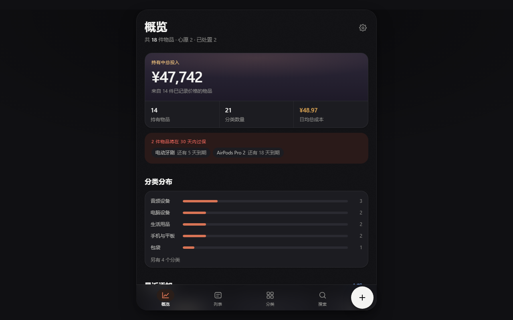 | 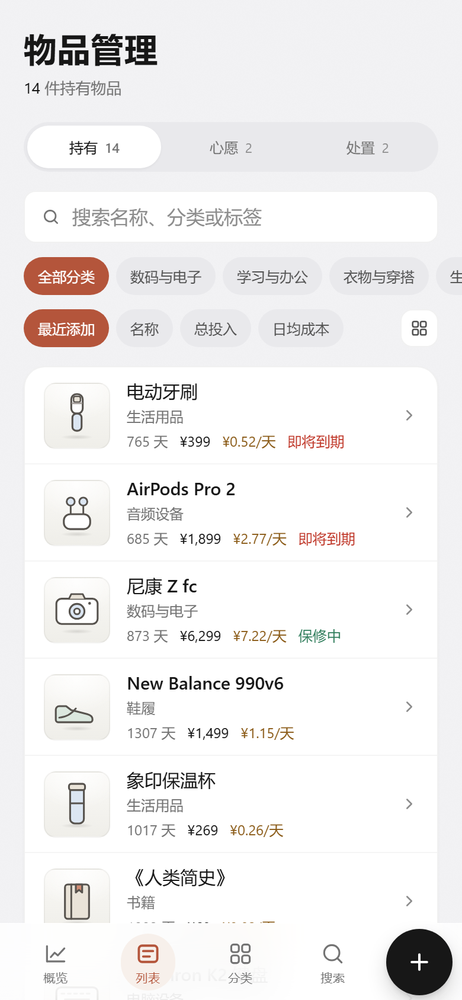 | 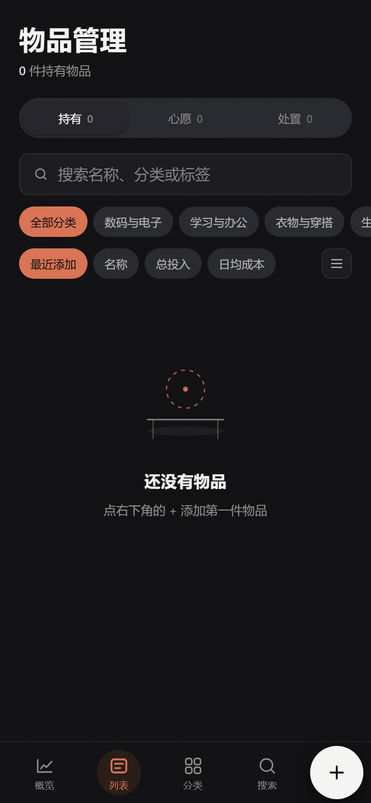 |

Phase 2G · 生命周期与 Dashboard

| 概览 · 浅色 | 概览 · 深色 | 详情 · 持有 | 详情 · 已出售 |
|---|---|---|---|
| 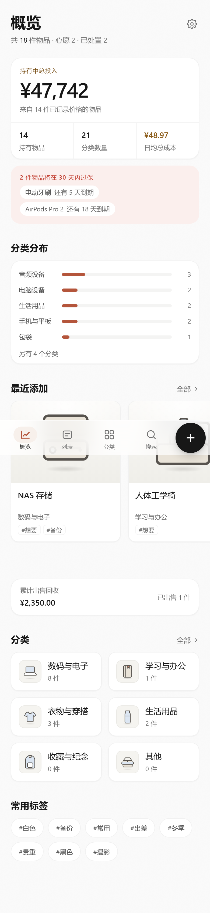 | 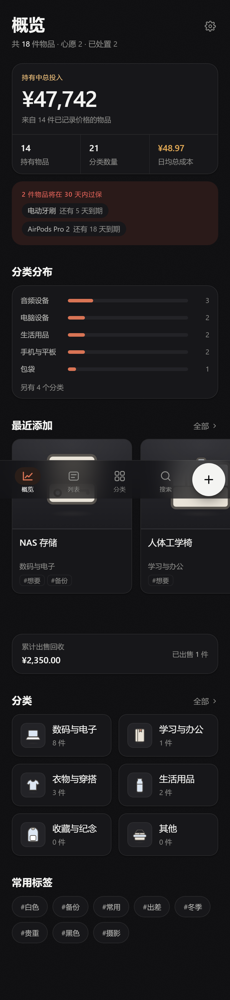 | 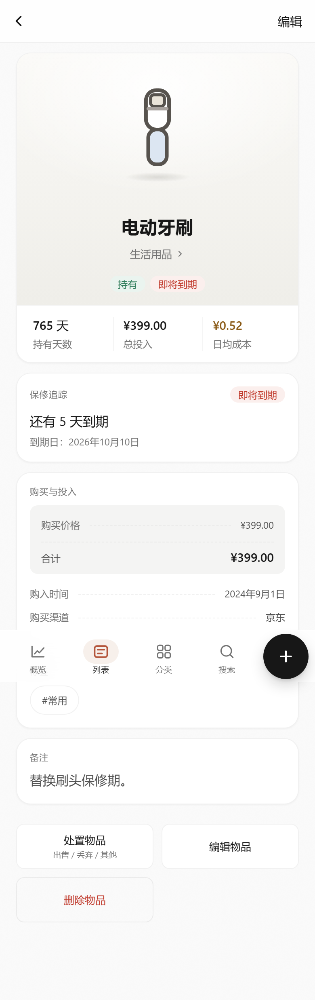 | 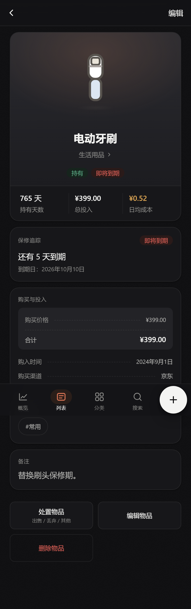 |

| 处置 Sheet | 心愿表单 | 列表视图 | 桌面取景框 |
|---|---|---|---|
| 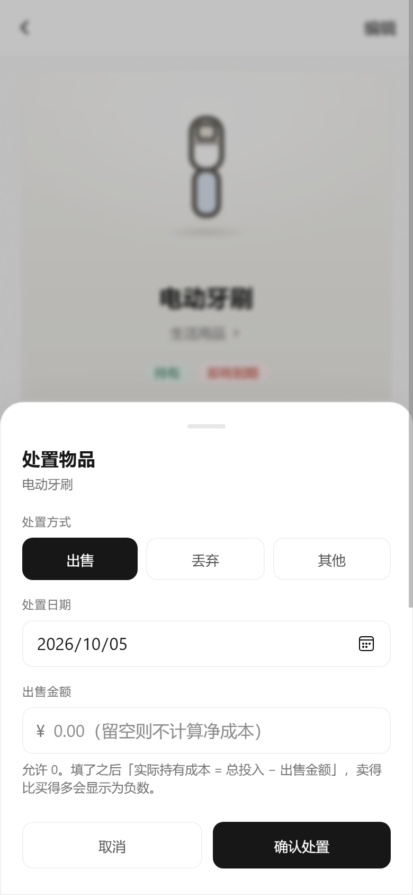 | 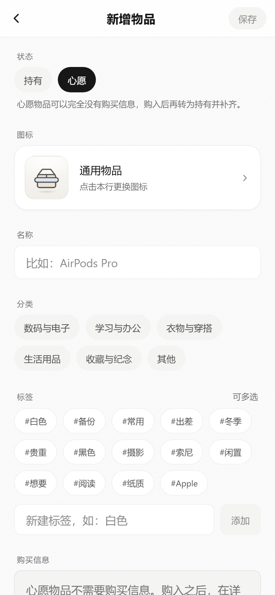 | 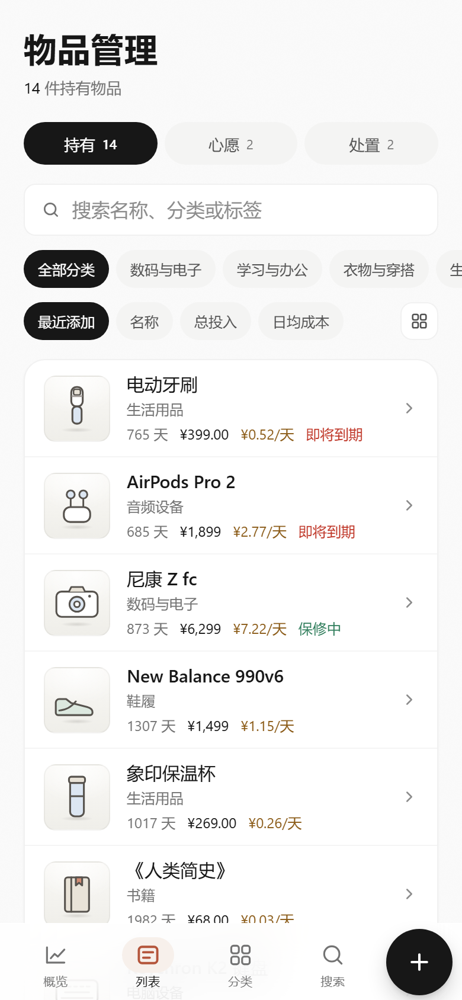 | 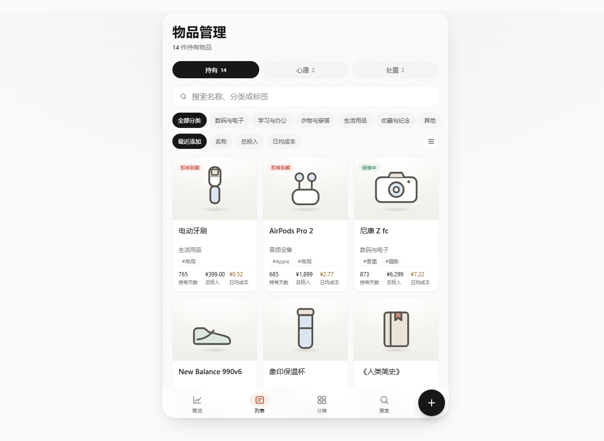 |

Phase 2F · 图标体系与三态主题

| 首页 · 浅色 | 首页 · 深色 | 详情 · 打光 Hero |
|---|---|---|
| 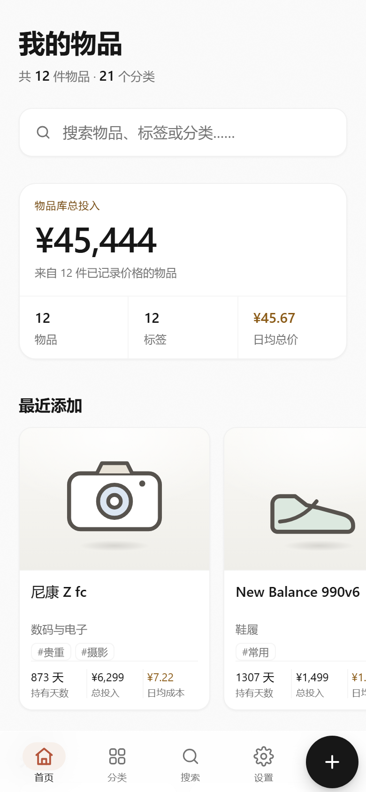 | 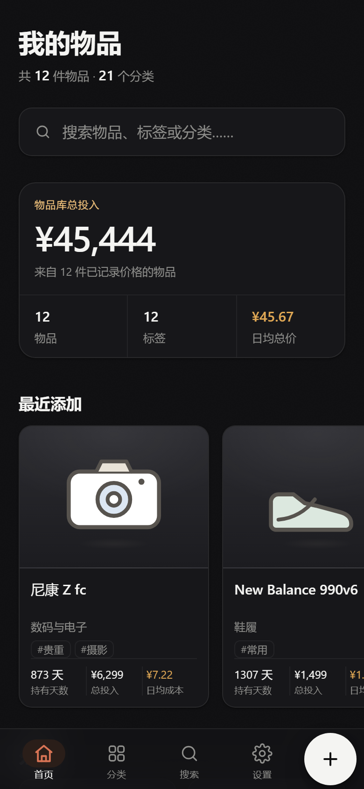 | 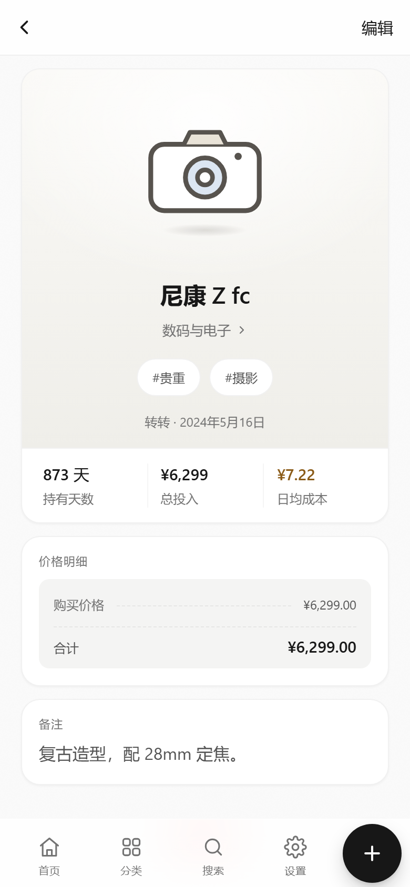 |

| 图标选择器 | 设置 · 外观 | 图标库（73 个） |
|---|---|---|
| 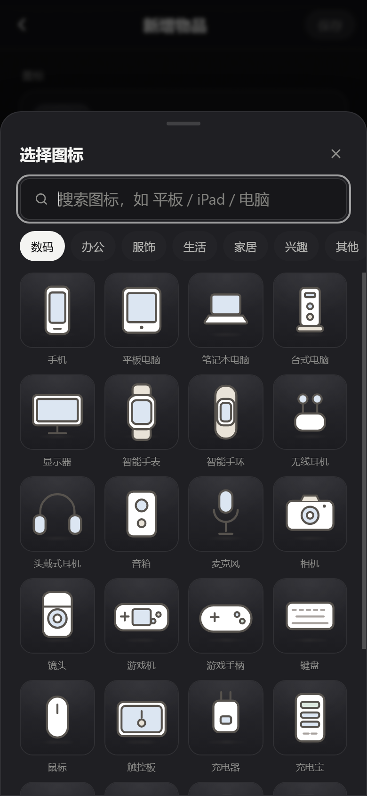 | 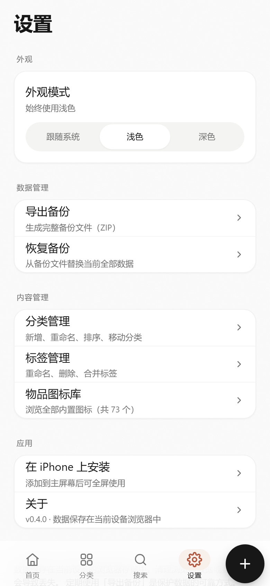 | 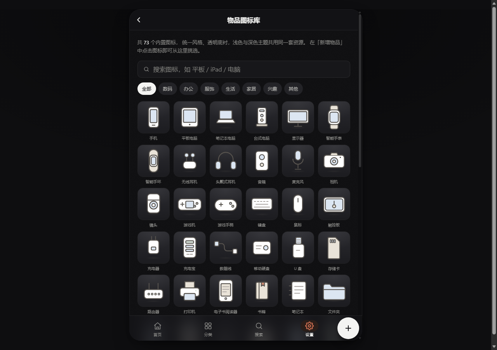 |


Phase 2E · 购买信息与日均使用成本

| 新增表单 | 详情页展示 | 购买信息随备份恢复 |
|---|---|---|
| 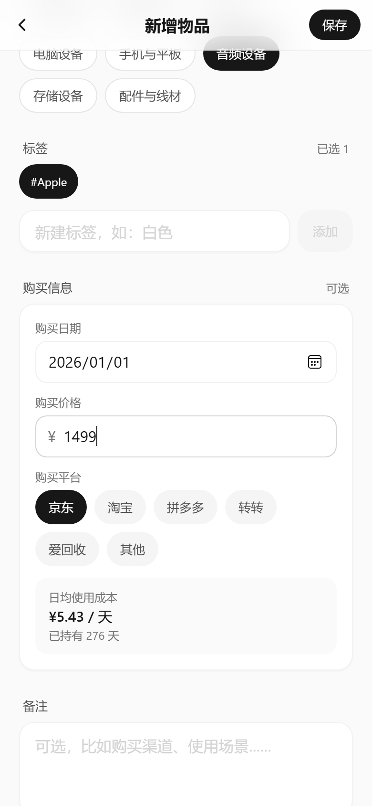 | 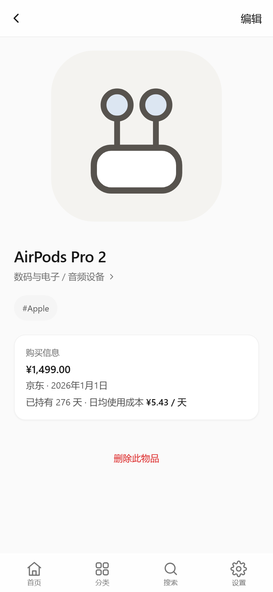 |  |

Phase 2C · 备份恢复与离线验证

| 恢复确认 | 恢复后 | 离线打开 |
|---|---|---|
|  |  |  |

Phase 2B · UI 原型（界面已迭代，此处仅作存档）

| 首页 | 分类 | 搜索 |
|---|---|---|
|  |  |  |

</details>

更多截图见 [`docs/screenshots/`](docs/screenshots/)。

---

## License

未提供开源许可证，保留所有权利。
