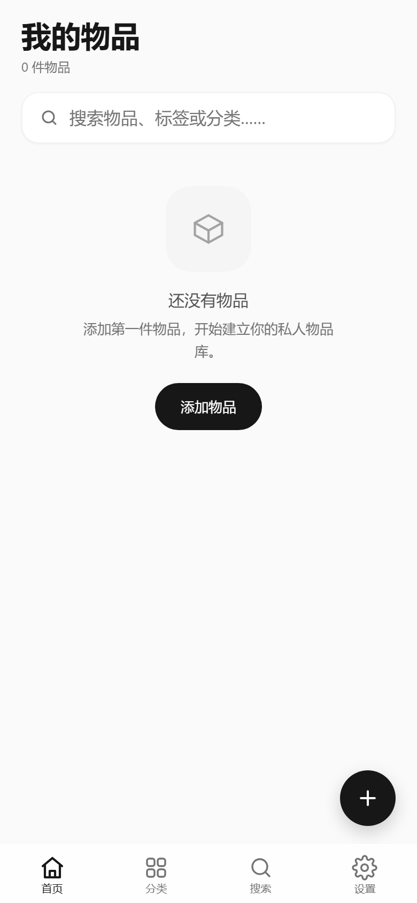
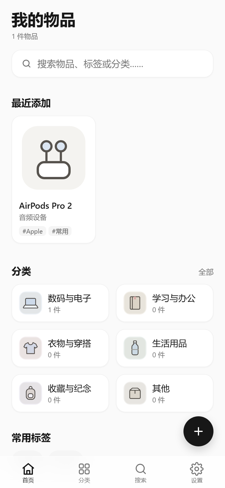
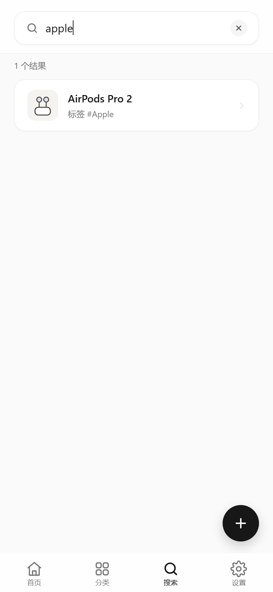

# Private Item Library · 私人数字物品库

一个 **local-first（本地优先）** 的个人物品管理 Web 应用。所有数据存放在浏览器 IndexedDB 中，**没有后端、没有账号、没有云端同步**——你的物品清单完全属于你自己。

适用于记录数码产品、家电、线缆配件、收藏品等个人物品：拍照、归类、打标签，然后随时用搜索找回"那个东西到底放哪了"。

---

## 当前状态

项目处于 **Phase 2B 完成** 阶段：本地数据与核心增删改查已全部打通。

| 阶段 | 内容 | 状态 |
|---|---|---|
| Phase 0–1 | 竞品调研、许可证核查、架构设计 | ✅ 完成 |
| Phase 2A | UI 原型 · 7 页面 + 移动端 HIG 精修 | ✅ 完成 |
| Phase 2B | 本地数据层 + 核心 CRUD + 单元测试 | ✅ 完成 |
| Phase 2C | 备份与恢复（zip 导出/导入）、PWA 离线安装 | ⬜ 未开始 |

> ⚠️ 这是一个**自用项目**，仍在开发中。设置页里标记为「即将支持」的功能（备份、恢复、离线安装）尚未实现，请勿用于唯一的物品清单存储。

---

## 技术栈

| 类别 | 选型 |
|---|---|
| 框架 | React 19 + TypeScript 5.9 |
| 构建 | Vite 7 |
| 样式 | Tailwind CSS 3（移动端优先，375 / 390 / 430px 三档自适应） |
| 本地数据库 | Dexie 4（IndexedDB 封装） + dexie-react-hooks |
| 路由 | react-router 7（BrowserRouter） |
| ID | ulid（可排序、URL 安全） |
| 测试 | Vitest + fake-indexeddb |

刻意**不引入**状态管理库、动画库、图表库与任何后端 SDK——这是一个纯前端、少依赖、可长期维护的项目。

---

## 快速开始

```bash
npm install      # 或 npm ci（严格按 package-lock.json 还原）
npm run dev      # 启动开发服务器 http://localhost:5173
npm run build    # 类型检查 + 生产构建
npm run preview  # 预览生产构建
npm run test     # 运行测试
npm run typecheck
```

首次启动会为空数据库写入种子数据：**21 个默认分类 + 12 个内置图标**。

---

## 目录结构

```
src/
├── components/     # 通用组件（BottomNav / ItemCard / Dialogs / Toast 等）
├── pages/          # 页面（Home / Categories / Search / Settings 等）
├── features/data/  # useLiveQuery 封装与视图模型
├── db/             # Dexie 实例与 repositories（唯一数据库调用方）
├── domain/         # 纯函数与业务逻辑（搜索打分 / 分类树 / 标签标准化）
├── data/           # 图标注册表
├── mock/           # 演示数据（仅开发环境手动调用）
└── types/
根目录：main.tsx（入口）、App.tsx（路由）、index.css（全局样式与 token）
docs/
├── architecture.md         # 架构设计与 Schema
├── reference-analysis.md   # 竞品调研与许可证核查
└── screenshots/            # 各阶段 UI 截图
scripts/                    # CDP 驱动的截图与端到端验证脚本
```

分层原则：`domain` 层是纯函数且**全部有测试覆盖**，`db/repositories` 是**唯一**允许直接操作 Dexie 的地方，页面层不接触数据库细节。

---

## 已实现功能

- **物品管理**：新增 / 编辑 / 查看 / 软删除，支持照片、备注、标签
- **分类树**：最多两级，展开折叠、数量徽标、祖先链计数
- **标签系统**：自动标准化去重，支持合并与重命名
- **搜索**：实时匹配，按名称 / 分类 / 标签加权打分排序，含最近搜索记录
- **管理页面**：分类管理（移动、排序、删除保护）、标签管理、图标库
- **删除保护**：分类非空时禁止删除，软删除（`deletedAt`）保留数据
- **测试覆盖**：43 个测试（domain 20 + repository 20 + seed 3）全部通过

---

## 界面预览

Phase 2B · UI 原型

| 首页 | 分类 | 搜索 |
|---|---|---|
|  |  |  |

| 新增物品 | 物品详情 | 设置 |
|---|---|---|
|  |  |  |

Phase 2B · 真实数据流程验证（新建 → 编辑 → 搜索 → 删除 → 刷新持久化）

| 空库 | 创建后 | 搜索 |
|---|---|---|
|  |  |  |

更多截图见 [`docs/screenshots/`](docs/screenshots/)。

---

## 数据说明

Dexie Schema v1 共 6 张表：

```ts
db.version(1).stores({
  items:      'id, categoryId, name, createdAt, updatedAt, deletedAt',
  categories: 'id, parentId, name, sortOrder, deletedAt',
  tags:       'id, &nameNormalized, createdAt',
  itemTags:   '[itemId+tagId], itemId, tagId',
  assets:     'id, kind, createdAt',
  appMeta:    'key',
})
```

数据仅保存在**当前浏览器当前域名**下。清理浏览器数据会导致丢失——这也是 Phase 2C 要做备份与恢复的原因。

---

## License

未提供开源许可证，保留所有权利。
