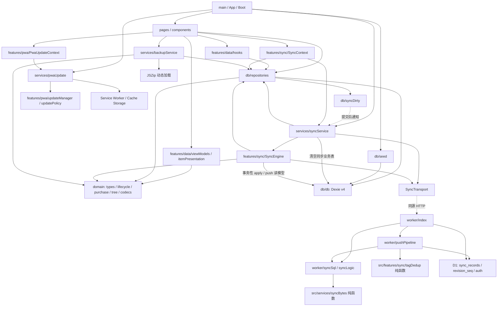

# Item Storage App 架构与可维护性独立审计

审计日期：2026-10-09（Asia/Shanghai）  
项目：HrrY1n/item-storage-app  
基准：本地分支 `main`，HEAD `9f2ee343d4e066a99679007ec77e4b4d13ff9eec`  
开始时 `git status --short`：空，工作区干净。报告路径事先不存在。本文所有 `路径:行号` 均相对于仓库根目录，指向该 HEAD；不是历史文档中的行号。

## 1. 执行摘要

**建议：保留当前架构，做局部可靠性修补和维护文档整理，不做结构性重构。**

这不是一个只有界面、缺乏工程基础的原型。它有清楚的本地优先数据流、集中式领域计算、事务性 repository、版本迁移、独立 ZIP 备份、服务端 SQL 保护以及大量有价值的回归测试。React 页面没有直接操作 Dexie，业务保存不等待网络，也没有为了架构形式引入状态管理、依赖注入容器或通用 CRUD 框架。规模与实现方式总体匹配。

不过，“目前功能可用、测试全绿”还不等于“数据交界场景已可靠”。本次确认了三个应优先修复的 P1：**恢复备份后旧同步请求仍能回写、异常成功响应导致待同步队列被清空、跨设备分类移动合并成环**。另有自动同步通知遗漏、飞行中改动缺少后续调度、同步结果展示失真等局部问题。它们集中在异步编排和协议边界，不要求推翻现有分层。

共记录 **15 项发现：P0 0 项、P1 3 项、P2 11 项、P3 1 项**。没有证据证明线上已发生这些故障，也没有读取实际用户数据。P1 的后果已由内存复核或明确代码路径支持，但都有具体触发条件；不把它们描述成全体用户持续发生的数据损坏。

评估负载：个人物品库、一台主力手机、少量辅助设备、低频整理；数百至数千条记录是合理评估背景。本轮未做容量基准，不以企业多租户、高并发协作系统要求评价本项目。

### 1.1 执行与证据边界

| 检查 | 实际结果与边界 |
|---|---|
| 本地环境 | Node `v24.14.1`、npm `11.11.0`；CI 配置为 Node 22，本轮没有切换 Node 或重新安装依赖 |
| `npm run typecheck` | **通过，退出码 0**；执行 `tsc -b`，包含 app/node/worker 三个项目 |
| `npm run test` | 首次沙箱内因 `fake-indexeddb/auto/index.mjs` 的 `realpath EPERM`，39 个套件均未进入测试；获准在沙箱外重跑后 **39 个文件、658 项全部通过，退出码 0** |
| `npm run build` | 首次沙箱内因 `index.html` 的 `realpath EPERM` 失败；放行后 **通过，退出码 0**。实际 Vite `7.3.6`、PWA 插件 `1.3.0` |
| 构建提示 | 主入口 JS 554.58 kB / gzip 170.63 kB；JSZip 独立块 97.30 kB / gzip 30.15 kB；预缓存 326 项、1001.95 KiB。`db` 与 `syncRepository` 同时被静态/动态导入，动态导入不产生拆包。均不是构建错误 |
| 定向复核 | 两段通过 stdin 执行的 Node 脚本；使用现有 esbuild 在内存打包真实模块、`fake-indexeddb`、`node:sqlite(':memory:')`、假 fetch。确认 9 项行为，见 §5.1；没有新增测试文件 |
| 依赖关系 | 用 TypeScript AST 扫描 src/worker 中 81 个非 `*.test.ts`、非 `*.d.ts` 文件（包含 SQLite 测试辅助文件）；分析相对路径 import/export 和字面量动态 import，**未发现文件级循环依赖**；该范围显式 `any` 关键字为 0，不代表运行时输入已安全 |
| 阅读范围 | 深读数据库 schema/seed、六个 repository、同步编排/传输/策略/配对、Worker HTTP/SQL/push、备份校验/编排、PWA 更新；核查全部页面/组件的依赖与主要交互路径、领域与视图计算、主题、入口、构建/CI/部署配置及核心测试。历史设计文档按现状相关章节交叉核对，未逐张审查历史截图或逐行审查图标绘制坐标 |
| 未执行 | 浏览器自动化、iPhone 真机、线上 Worker/D1、部署、迁移命令、依赖安装/升级、Git commit/push。未调用浏览器启动器，未接触用户 Edge profile |
| 文件影响 | 仅新增本报告；测试/构建按允许命令产生或更新被忽略的本地缓存、tsbuildinfo、dist 产物。没有修改既有源码、测试、配置、文档或依赖清单 |

“658 项通过”只证明当前断言通过；README 的真机及历史浏览器验收是历史证据，本轮没有复验。没有执行 `npm ci`，因此不把本次成功等同于全新机器安装复现或远端 CI 已通过。

## 2. 当前真实架构图

箭头表示实际依赖/调用方向；虚线表示事件通知或 HTTP，不表示反向 import。

### 2.1 数据库边界的判断

`docs/architecture.md:18,26-41` 和 `src/db/db.ts:15-18` 的“只有 repository 可以 import db”**不是实际完整规则**。实际直接导入者包括六个 repository、`db/seed.ts`、`features/sync/syncEngine.ts`、`main.tsx`、`mock/loadDemoData.ts`，以及 `syncService.ts:329` 的动态导入。

- 页面、普通组件、数据 hooks 没有绕过 repository：关键 UI 边界成立。
- schema/seed 处于数据层；main/mock 的直接写库用于 DEV 工具，属于可明确列出的例外。
- `syncEngine.ts:369-449` 同时修改业务表、关联和 outbox，**让它持有跨表事务是合理的应用编排例外**。没有理由仅为目录规则把每个 `db.*` 包成无意义代理函数。
- 引擎已经同时承担网络循环、去重、冲突记录与多实体落库，今后修改 apply 规则时，可以整体提取“远端批次应用”到一个数据层函数；保持事务完整，并由原引擎调用。这个调整应服务于 F01/F03 的正确性，不应先做大规模搬文件。
- `syncService.wipeSyncableLocalData` 是明确的跨层直接写库；与恢复/重新配对统一事务和同步失效机制，比单独改 import 路径更有价值。
- Worker 引用前端目录中的 `tagDedup` 和 `syncBytes`，当前二者都是无 UI/平台状态的纯逻辑，未造成前后端运行时绑死。目录名称容易误导，但不是引入新 package 的充分理由。

## 3. 模块职责评价

| 模块 | 值得保留的部分 | 实际维护成本/限制 |
|---|---|---|
| `main.tsx` / `App.tsx` | 装配入口集中；Boot 先 seed/补图标再渲染；DEV 数据工具有环境开关 | 同步启动与 Boot 并行，需要在恢复/初始化生命周期变更时一起考虑；初始化失败仅统一提示，诊断信息较少 |
| `pages` | 负责交互与展示，写操作调用 repository/service；表单与详情共用领域计算 | Settings 同时编排备份、配对、同步与更新，异步结果最容易失真；ItemForm 初始化/加载状态有缺口。长 JSX 本身不是重构理由 |
| `components` | 图标、卡片指标、状态、分段控件、提示和对话框已有复用 | 通用 Dialog 未统一焦点、语义及更新保护；比抽象更多视觉容器更值得处理 |
| `features/data` | useLiveQuery 保持本地库为真实数据源；itemPresentation 统一列表/网格处置文案及盈亏口径 | loading 与 not-found 使用同一个 undefined；逐卡 join/重建 Map 和全表读取适合当前规模，未测得性能瓶颈，不要求现在上索引/虚拟列表 |
| `domain` | 日期用日序号、金额以分存储；生命周期与备份迁移是可测试纯逻辑 | 同步 codec 的枚举/业务收敛弱于备份；存在少量旧派生接口。backup.ts 的长度主要来自显式校验，保留比通用反射校验更容易追踪 |
| `db/db.ts` / seed | v1→v2/v3 仅补缺失字段；v4 新增同步表；seed 与 preset 更新分开，保留用户分类和旧资产 | v1 实际升级路径缺少专门回归；“零数据风险”等绝对措辞不应代替平台故障测试 |
| repositories | 业务写入与 outbox 同事务；标签唯一索引；关联复合主键；恢复整体回滚 | 部分检查/读取在事务外；分类约束只守住单机操作，不能自动保证远端合并后仍合法；tag delete 漏通知 |
| `features/sync` / syncService | push 失败停止 pull、精确 outbox entry ID 保护飞行中编辑、注入 fetch/时钟便于测试 | 最复杂模块；缺少会话失效/恢复互斥、后续调度、严格响应校验。错误吞掉与真实成功在 UI 层被混淆 |
| `worker` | HTTP、纯判定、SQL 与批处理分开；参数绑定集中；revision 和数据同 batch；SQL tombstone 防线；tag 唯一索引与整批重试 | HTTP 请求整体只是类型断言，真实处理路径测试少；认证失败按整个空间计数；手写平台类型与测试 schema 有漂移维护成本 |
| `services/backupService` | 校验阶段不写库；JSZip 懒加载；业务数据与凭据隔离 | 业务恢复与同步重置分两阶段；未取消在途同步。`readSnapshot:20-28` 是多表独立读取，不是显式一致性读事务，应在并发导出测试中验证，不直接宣称已发生混合快照 |
| PWA | 唯一注册点；更新策略/平台 host 分离；阻止编辑期 reload；App Shell 映射到 `/`；缓存与 IndexedDB 分离 | 更新保护没有覆盖全部输入界面；真实 iOS、存储驱逐、配额不足的行为仍需设备验收 |
| theme / icons / CSS | 语义 token、浅深色一致性测试、首帧主题脚本；图标元数据/生成产物有契约测试 | 内容与视觉代码较多，不等于业务耦合；本轮未提出重新设计 |
| 配置、CI、脚本 | lockfile、strict TS、未使用变量检查、PR/main 测试与构建、独立浏览器 profile 规则 | 无 React 组件测试、无自动 Hooks lint；Node 本机/CI 不同；浏览器脚本依赖本地端口/Windows Edge，不应把历史脚本数量当当前 CI 覆盖 |

### 3.1 复杂度集中在哪里

`syncEngine.ts` 548 行、`syncService.ts` 338 行、`SettingsPage.tsx` 632 行是最需要谨慎接手的组合：一次恢复/配对跨越 UI、本地凭据、队列、网络和事务，单独看任一函数容易漏掉仍在进行的请求。`ItemFormPage.tsx` 643 行、`ItemDetailPage.tsx` 553 行、`ItemsListPage.tsx` 511 行主要是 JSX 和局部交互，不能据此认定必须拆分。`domain/backup.ts` 517 行以结构校验为主，拆成泛型校验框架反而会增加阅读成本。

新增一个仅影响显示的功能，通常涉及 domain/视图模型、页面或组件及对应测试，范围可控。新增一个需要持久化和同步的字段，则至少需要核对：类型、repository 默认/写入、Dexie 历史升级、备份版本/迁移、同步 encode/decode、表单/展示、fixture/测试。常见影响约 6–10 个文件，但按职责必需；D1 JSON 载荷通常不需加业务列。当前缺的是这份变更清单成为正式维护入口，而不是再加一层 service。

## 4. 工程质量参考评分

以下为 10 分制判断，**不是客观测量、不是测试覆盖率，也不以平均分决定是否重构**。按个人 Local-first PWA 的目标评价。

| 维度 | 参考分 | 依据 |
|---|---:|---|
| 功能实现 | 8.0 | CRUD/生命周期/备份/离线/同步链路齐全；存在金额显示、无记录页面及结果提示问题 |
| 架构 | 8.0 | 分层实用、无扫描到的文件循环依赖、低框架负担；异步生命周期边界需补强 |
| 代码规范 | 7.5 | strict TS、明确类型及大量纯函数；运行时断言不足、历史注释与死分支降低信任度 |
| 测试 | 7.5 | 658 项实际通过，真 SQLite 装配测试有价值；缺少恢复并发、HTTP→UI、v1 升级和跨实体合并保障 |
| 稳定性 | 6.5 | 本地事务基础扎实；三个 P1 说明同步/恢复交界仍不适合无条件宣称数据可靠 |
| 可维护性 | 7.0 | 新人能找到主要职责和测试；“当前架构”文档过时、散落历史修订与运行时结果不一致影响接手 |

## 5. 问题清单（P0 → P3）

没有发现需要立即停用整个应用的 P0。以下成本按熟悉 TypeScript 的维护者估算，包含定向回归，不是交付承诺。已确认表示代码或隔离复核已证明该行为，不表示在线上观察到事故。

### F01 · P1 · 恢复备份没有使正在进行的同步失效

- **证据**：`src/services/backupService.ts:239-255` 先替换业务表，再单独 clearQueue/disable，并吞掉后者异常；`src/db/repositories/backupRepository.ts:46-71` 事务未包含同步状态/队列。`src/features/sync/syncEngine.ts:113-122,185-198` 在开头读取凭据后继续 pull/apply，写入前不核对会话是否已关闭/替换。`src/services/syncService.ts:298-335` 云端加入同样分步清库和配置信息。
- **触发与影响**：同步 pull 已发出、响应暂停；用户恢复 ZIP 后同步关闭；旧响应返回，仍覆盖恢复数据并推进游标。定向复核中名称从 `restored-new` 回到了 `remote-old`，当时 enabled 已为 false。恢复最后一步失败被静默吞掉，也可能留下仍启用的同步状态。
- **测试保护**：`backupRepository.test.ts:158` 测业务恢复事务回滚；`backupSyncExclusion.test.ts:71-105` 测底层替换不带入凭据；`syncEngine.test.ts:714` 测编辑 V1/V2。均未覆盖在途请求与恢复交错。
- **最小修复**：恢复前阻止新同步，使旧轮次失效；在落库事务内校验同步会话代次，不能只 abort fetch。业务替换、清队列、禁用/重置状态放入同一事务。关闭和重新配对复用同一失效规则，避免跨标签页仅靠进程内布尔值。补延迟 pull、延迟 push、事务失败、重新配对回归。
- **成本/风险/置信度**：1–2 天；中高回归风险，必须保持正常 CRUD 不等网络；**已确认（隔离复现）**。

### F02 · P1 · HTTP 200 的损坏响应被当成功，丢失 outbox 意图

- **证据**：`src/features/sync/syncTransport.ts:138-145` JSON 解析失败置 `data=null`，仍保留 200；`:209-224` 将其构造成成功 push，`:233-241` 将其构造成空 pull。`syncEngine.ts:150-153` 对成功批次的仍在场条目出队，不检查该响应是否具有合法协议形状。
- **触发与影响**：错误路由返回 HTML、服务端变更返回不兼容 JSON 或空 200；本地条目未确认上传就出队。假 fetch 全部返回 `200 <html>not API JSON</html>` 时，真实引擎 `ok=true`、pending 从 1 变 0。当前 wrangler 路由已显式区分 API，不能据此断言当前正常部署会返回 HTML；这是确实存在的失败边界。
- **测试保护**：`syncTransport.test.ts:42-126` 覆盖 signal、离线与 HTTP 错误码，未覆盖成功码携带错误内容。已有测试的正常 fake cloud 总会返回约定形状。
- **最小修复**：每个端点验证必需字段与数组成员、游标有限且合理；无法解析或格式错误必须失败并保留队列。明确 accepted/ignored/dedup 三种终结语义，不简单把所有 ignored 永久重试，也不将字段缺失默认成成功。补 HTML/空 JSON/非法游标与批次回执测试。
- **成本/风险/置信度**：0.5–1 天；中风险，注意与旧服务端的兼容；**已确认（隔离复现）**。

### F03 · P1 · 单机分类无环约束不能保护跨设备合并

- **证据**：`src/db/repositories/categoryRepository.ts:65-83` 仅用本地快照判定移动；`worker/syncLogic.ts:86-107` 逐实体接受更新；`src/features/sync/syncEngine.ts:481-496` 直接写 parentId；`src/pages/CategoryManagePage.tsx:16-22,145` 从根节点渲染树。
- **触发与影响**：A/B 起初都是根分类。设备甲离线把 A 移到 B 下，设备乙离线把 B 移到 A 下，两次各自合法；同步合并后 A↔B 无根。复核中真实 Worker push 接受这两条、真实引擎 apply 后两条都在库中，但 `childrenOf(categories,null)` 为空。分类管理与根树入口无法访问它们；不是物理删库，物品仍可从总列表找到。
- **测试保护**：categoryTree/categoryRepository 测本地防环；没有覆盖跨设备合法操作合并后成环。备份分类校验 `domain/backup.ts:301` 起也仅检查行结构。
- **最小修复**：为合并后的分类图定义确定性的环处理规则，例如按固定 ID 规则将一条成环父边置为根、保留记录并记录修正；修正需跨设备收敛且不丢待推编辑。备份导入可在写入前直接拒绝成环。不要因分页暂缺父节点就删除分类。先补两设备相反移动及跨页回归，再局部实现。
- **成本/风险/置信度**：1–2 天；中风险，需要明确修正语义；**已确认（内存 Worker 与引擎复核；非真实双浏览器联网实验）**。

### F04 · P2 · 删除标签写了队列，却没有发出本地改动通知

- **证据**：`src/db/repositories/tagRepository.ts:80-93` delete 事务结束直接返回；create、rename、merge 在 `:43,71,123` 调用 `markSyncDirty()`。调用者 `src/pages/TagManagePage.tsx:74` 没有补发同步。定向订阅 dirty 后删除标签得到 0 次通知，但队列有 delete。
- **触发与影响**：仅删除标签、之后保持当前页面且无其他改动时，不会在 2.5 秒后上传；要等手动/重新前台/联网等触发。数据仍在队列，不是丢失。
- **测试保护**：syncOutbox 测删除入队；`localChangeSync.test.ts:396` 测部分分类/标签写入通知，没有钉住 delete。
- **最小修复**：事务成功后补一处 `markSyncDirty()`，加删除成功通知一次、事务失败不通知的断言。
- **成本/风险/置信度**：小于半天；低风险；**已确认（隔离复现）**。

### F05 · P2 · 同步飞行中收到的自动触发会被丢弃，没有后续追赶

- **证据**：`src/features/sync/localChangeDebounce.ts:53-57` 定时器触发即清 pending；`syncPolicy.ts:94-102` inFlight 直接 false；`services/syncService.ts:104-112` 不记待重跑；`syncEngine.ts:207-216` 结束时不安排后续轮次。
- **触发与影响**：V1 上传慢于 2.5 秒；期间用户保存 V2，debounce 到期遇到 inFlight，触发被消费。V2 正确留在本机和 outbox，但当前轮完成后没有自动上传。复核确认 V2 保留、pending=1，引擎没有额外请求。持续前台且没有新事件时，云镜像落后。
- **测试保护**：`syncEngine.test.ts:714-746` 保护 V2 不被覆盖；`localChangeSync.test.ts:307` 仅断言飞行中禁止重复，没有测试结束后补跑。
- **最小修复**：在统一调度处记录“运行中又有本地改动”，结束后只补一次；失败/离线时避免立即无限循环。无需常驻轮询，也不要放松 inFlight 互斥。
- **成本/风险/置信度**：0.5–1 天；中风险；**已确认（真实引擎行为＋调度代码核查）**。

### F06 · P2 · 同步结果在传到界面前被丢弃，异常也不完整落状态

- **证据**：`src/features/sync/SyncContext.tsx:54-58` 忽略 `e.run()` 的 outcome；`SettingsPage.tsx:217-225` Promise 完成即显示“同步完成”；`:297-303` 在真正同步前就显示“已用云端数据恢复此设备”。`syncEngine.ts:204-213` catch 返回 unknown 却未给局部 errorKind 赋值，finally 不执行 markError；markError 本身也是未等待的 Promise。`:198` pull 失败路径仍调用 markSynced。关闭 `SettingsPage.tsx:325-330` 也没有 refresh，Context 不是 live query。
- **触发与影响**：401/500、解码落库异常或换机拉取失败时，用户可能收到成功 toast；异常复核中 outcome=unknown、持久 lastError=null。同步关闭后 summary 可继续显示旧状态直到下次刷新，增加排障难度。不要将“不会阻断本地保存”实现成“所有结果都算成功”。
- **测试保护**：有引擎 summary 与错误分类测试，缺少 Context→Settings 结果链和关闭后的响应式测试。
- **最小修复**：syncNow 返回 outcome，成功后才提示完成；expected failure 显示简短状态；catch 统一记录 errorKind 并安全等待状态更新；markSynced 只表示完整成功，部分 pull 游标另行保存；配置变化后刷新摘要或订阅对应本地状态。初始化异常至少保留不含凭据的诊断原因。
- **成本/风险/置信度**：0.5–1 天；低至中风险；**已确认（错误状态隔离复现，UI 结论为直接控制流证据，未跑浏览器）**。

### F07 · P2 · 认证失败锁定按共享空间累计，错误请求会挡住正确凭据

- **证据**：`worker/index.ts:72-92,106-117` failures 以数据库 row.key_id 为键，且先检查锁定、后验证 token。
- **触发与影响**：任意调用者连续发送 10 个错误 Bearer，同一 isolate 随后的合法请求得到 429，最长受 10 分钟窗口影响。内存 HTTP handler 复核得到该结果。不同 isolate 的状态不共享，因此不能声称所有用户请求必然连续 10 分钟被封锁；这是可用性问题，不是认证绕过或泄密。
- **测试保护**：纯 bearer/hash 比较有测试，实际 authenticate 锁定顺序没有现有回归。
- **最小修复**：合法凭据不应被其他请求累计的失败阻断；最小方案移除这个共享锁定，或改为受信任来源限流并让有效 token 正常通过。保留随机 secret 与校验，不引入账号体系。新增 10 次错误后合法 token 的 handler 测试。
- **成本/风险/置信度**：小于半天；低风险；**已确认（同一 isolate 的假 D1/真实 HTTP handler 复核）**。

### F08 · P2 · 同步解码使用类型断言，不能维持备份/本地写入的业务契约

- **证据**：`src/domain/syncPayload.ts:176-185,266-268` 将任意字符串断言为 status/sourceType/disposalMethod，金额仅要求有限数字；不调用 lifecycle 规范化。`worker/index.ts:175-182` 只确认 changes 为数组，`worker/syncLogic.ts:89-107` 不检查业务 payload。对比 `domain/backup.ts:230-270` 的枚举检查及 sanitizeLifecycle。
- **触发与影响**：持凭据的旧版/有缺陷客户端上传未知 status、负金额或不一致生命周期；真实 decoder 接受 `status:'broken'`。部分 UI 用 statusOf 兜底为 owned，但数据导出后备份 validator 会拒绝该 status，形成自己导出的数据不能正常导入的风险。不是在证明匿名攻击可写数据库。
- **测试保护**：syncPayload 已测空值和 tagIds 去重，未保护非法枚举与备份往返一致性；领域计算有部分防御，不能代替入口收敛。
- **最小修复**：复用枚举判定和生命周期规范化；未知新增字段仍可忽略，已知字段非法则明确拒绝/隔离并可诊断，不要静默冒充合法值。补“同步落库→导出→校验”回归；Worker 最少验证 envelope，避免 null 成员或错误字段进入编排。
- **成本/风险/置信度**：0.5–1 天；中风险，需约定旧版本兼容；**已确认（非法状态被接受），备份后果由校验代码直接支持**。

### F09 · P2 · PWA 更新保护漏掉分类/标签编辑与恢复流程

- **证据**：useUpdateGuard 仅在 `ItemFormPage.tsx:136`、`DisposalSheet.tsx:45`、`ConvertToOwnedSheet.tsx:41` 使用。`components/Dialogs.tsx:110-137` 的 FormDialog、`CategoryManagePage.tsx:179-232`、`TagManagePage.tsx:157-208` 及 Settings 备份/恢复/恢复码输入没有 guard。`features/pwa/updateManager.ts:106-133,165-168` 未 blocked 即可 reload。
- **触发与影响**：新 SW 就绪时用户正在分类/标签表单输入，会刷新并丢未保存输入；恢复/配对的多阶段操作也可能被中断。数据库事务仍有自身原子性，不据此推断一定清空半个数据库。
- **测试保护**：updateManager 对 blocked 有充分纯逻辑测试；未测试这些实际调用点是否登记 blocked。
- **最小修复**：FormDialog 统一在打开时登记稳定 guard；标签页内新增输入、Settings 未保存输入与关键异步操作补 guard。验证关闭/卸载正确释放，避免一次遗漏导致永久不更新。
- **成本/风险/置信度**：半天；低至中风险；**高可信推断（调用点缺失已确认，未执行 SW/UI 时序实验）**。

### F10 · P2 · 缺失物品与加载中共用 undefined，详情/编辑页一直空白

- **证据**：`features/data/hooks.ts:21-23` useItem 返回 Item 或 undefined；`ItemDetailPage.tsx:192-195` undefined 先被 loading 拦截，后面的“物品不存在”不可到达；`ItemFormPage.tsx:139-164,207` 找不到记录则 initialized 永远不变。
- **触发与影响**：打开已删除/错误 id 的深链，或详情打开期间远端删除该物品；页面长期空白，无法说明是记录不存在还是仍在加载。
- **测试保护**：repository 已测 getActive 对删除项不返回；缺少路由/组件状态测试。
- **最小修复**：hook 用 undefined 表示查询未完成、null 表示完成但不存在；一并更新所有 useItem 调用者及页面 empty state。无需引入新的数据请求框架。
- **成本/风险/置信度**：小于半天；低风险；**已确认（类型和值域及分支控制流），未跑浏览器**。

### F11 · P2 · 非整元大额卡片金额被四舍五入，违反现有展示约定

- **证据**：`domain/purchase.ts:115-141` formatCentsCard 非整元转调 formatCentsCompact，后者对 ≥1000 元省小数。真实函数 `formatCentsCard(149999)` 返回 `¥1,500`，应按其契约显示 `¥1,499.99`。`features/data/itemPresentation.ts:166-205` 用于投入/回收/盈亏展示。
- **触发与影响**：金额 ≥1000 元且非整元；卡片与精确金额不同。只影响展示，数据库里的分值没有被修改。
- **测试保护**：`purchase.test.ts:208-210` 名为“非整元绝不做四舍五入”的测试只使用 57.14；大额测试都是整元，缺少交叉边界。
- **最小修复**：卡片非整元分支调用精确 formatCents，保留日均 compact 的既定策略；补正负大额非整元测试。
- **成本/风险/置信度**：小于半天；低风险，检查长数字布局即可；**已确认（隔离复现）**。

### F12 · P2 · 通用对话框缺少模态语义和焦点管理

- **证据**：`components/Dialogs.tsx:5-16,44-69,110-137` 只有 portal/div/遮罩，无 dialog role、aria-modal、标题关联、初始焦点、焦点约束与关闭后焦点恢复；共享 Overlay 没有 Escape 处理。相比 `IconPickerSheet.tsx:92-93` 已声明基本语义，但也不能由此推定完整焦点行为。
- **触发与影响**：键盘或读屏用户操作删除/分类编辑时，焦点可能仍在背景页面，无法可靠识别并限定当前操作。不是纯审美问题。
- **测试保护**：没有 DOM/键盘焦点回归；本轮未跑读屏器。
- **最小修复**：在现有共享 Dialog 中补语义、焦点进入/退出/约束和 Escape；保留既有视觉。可评估平台 dialog，但不是要求全站更换组件库。
- **成本/风险/置信度**：0.5–1 天；低至中风险；**已确认（实现缺失），具体读屏表现待设备验证**。

### F13 · P2 · 当前架构入口与实际实现不一致，影响新人安全接手

- **证据**：`docs/architecture.md:1-7` 声称当前真实结构却是 v0.3.0/契约2；`:26-41` 未列同步例外；`:241-243` 仍是旧注册与 App Shell 说明。`db/db.ts:17` 的绝对导入禁令与实际不符。详细对照见 §6。
- **触发与影响**：新 Agent 按此恢复 `/index.html` 回退、增加第二注册入口、只修改旧字段清单，或为满足“只有 repository”机械拆散同步事务，均可能引入回归。历史 Phase 文件本身有价值，问题是缺少明确的现行入口和被取代标记。
- **测试保护**：没有自动文档一致性检查；构建/单测不能发现所有错误维护指引。
- **最小修复**：更新一份短的当前架构说明，列出实际例外、三种版本、同步生命周期和改字段清单；旧阶段文档标记历史，并链接现行段落。AGENTS 保留安全规则，可增加维护入口链接，不需复制整本设计文档。
- **成本/风险/置信度**：半天；低风险；**已确认（源码对照）**。

### F14 · P2 · 回归保障强在内部逻辑，弱在真实入口与跨层场景

- **证据**：`src/db/migration.test.ts:13-37,58-110` 建的是 v2 库，实际验证 v2→当前；`migration-v4.test.ts:215-289` 验证 v3→v4，未发现建立真实 v1 库升级到 v4 的测试。`vitest.config.ts:5-9` 为 Node 环境并仅收集 `.test.ts`；现有用例无 React 组件测试。`worker/workerPushAssembly.test.ts:556-585` 的查询预算用例只有 3 条变更，不是 MAX_PUSH 32 条重试边界。`.github/workflows/ci.yml:16-29` 跑 test/build，未运行浏览器验证。
- **触发与影响**：旧库首次跨多版升级、Settings 成功提示、HTTP envelope/认证及最大批次重试被改坏时，现有套件可能仍绿。F01/F02/F04/F10/F11 是具体例证；不是说现有 658 项测试无价值。
- **测试保护**：现有迁移、repository 回滚、纯函数、真 SQLite SQL 装配覆盖扎实；缺的是上述交界，不建议追求无目的的 100% coverage。
- **最小修复**：随 F01–F12 各补最小复现；额外补真实 v1→v4，Worker fetch→内存 D1 的契约测试、32 条且冲突靠后的预算用例。页面至少覆盖 missing/success/failure 与 guard 接线；浏览器自动化只能使用项目隔离启动/停止约定。后续小步加入 Hooks 规则检查即可，无需先引入大套测试平台。
- **成本/风险/置信度**：1–2 天，部分计入对应修复、不重复估算；低产品回归风险；**已确认（测试范围缺口）；未声称最大批次已在真实 D1 超限**。

### F15 · P3 · 部分历史策略/接口没有运行时消费者，造成虚假的功能暗示

- **证据**：全仓检索（含测试、文档和脚本）显示 `syncPolicy.ts:60-64,135-149` 的自动重试/退避仅被测试调用；引擎 `:62,201-213` retryCount 只写不读。`domain/syncPayload.ts:271-276` readTagIdsFor 是无人调用的转发；`domain/lifecycle.ts:93-100` ownershipDaysUntil 无调用；`features/data/viewModels.ts:119-121` grossCostCents 仅历史文档提及，libraryOverview `:138-168` 仅测试调用。`syncEngine.ts:153,177-182` 已出队的成功 ID 又要求仍在队列中，正常路径 succeededEntities 恒空，`:435-437` 成功集合清队列分支没有实际作用。
- **触发与影响**：维护者以为已经存在“30 秒后自动重试”或另一个有效概览口径；新增代码误用旧接口，增加必须同时理解/维护的面。当前失败重试实际依赖下一次用户/生命周期事件，README 触发表更接近事实。
- **测试保护**：有退避函数单测，但它们不证明运行时会重试；有回声防护测试，真正有效的是 pending/outbox entry ID 检查，不是该空集合分支。
- **最小修复**：明确是否需要定时重试；没有需求就删掉未接线策略/计数及仅服务它的测试，并纠正注释。清除确认无消费者的旧 helper；删除空集合分支前保留并跑 V1/V2、tombstone 回归。`src/types/index.ts` 的兼容重导出仍有页面消费者，不要一并删除。预留资产类型不作为本轮优先清理目标。
- **成本/风险/置信度**：半天；低至中风险；**已确认（引用检索与控制流）**。没有据此建议删除任何当前运行必需的 npm 依赖，也不编造节省行数。

### 5.1 定向复核记录与复审方法

使用现有 esbuild 的 `build({bundle:true, platform:'node', format:'cjs', packages:'external', write:false})` 内存编译 stdin 里的实际源码 import；Node `createRequire` 加载 `fake-indexeddb/auto` 后执行编译结果。每段复核使用进程内新数据库；SQL 辅助器使用 `:memory:`。假 fetch 从不访问网络。没有创建复现文件。

| 观察 | 输入/时序 | 实际断言结果 |
|---|---|---|
| 标签删除通知 | create tag；随后订阅 dirty；delete | 通知 0、队列 op=delete |
| 恢复竞态 | engine.run 的 pull 等待闸门；restore 同 ID 新名字；释放旧响应 | restored-new 被覆盖回 remote-old，enabled=false |
| 损坏响应 | 队列有一个物品，所有请求返回 200 HTML | outcome.ok=true，pending=0 |
| 异常诊断 | pull 返回 changes:[null] | outcome.errorKind=unknown，state.lastError=null |
| 不合法业务枚举 | decodeItemPayload('bad',{name:'x',status:'broken'}) | status 保留 broken |
| 空间锁定 | 同一 handler/environment 先 10 次 wrong Bearer，再正确 token | 前者各 401，后者 429 |
| 飞行中编辑 | V1 push 挂起；真实 repository 保存 V2；shouldSync(local-change)；释放 V1 | shouldSync=false；V2 保留；pending=1；只有本轮 push+pull 两次调用 |
| 分类环 | 两个根各自的移动均通过 wouldCreateCycle；两条合并变更交给 executePush 与引擎 | Worker 接受；本地两行；根分类数为 0 |
| 大额精度 | formatCentsCard(149999) | ¥1,500 |

这些是对当前实现的**失败行为验证**，不是已经加入仓库的回归测试，也不计入 658 项。建议独立复审先按表中时序重建 F01–F03；只需要假网络和内存库，不需要连接线上 D1。复核 F05 的完整浏览器调度、F09/F12 的 UI 行为仍应遵守隔离浏览器规则。

## 6. 文档与代码不一致清单

| 文档/注释证据 | 当前代码事实 | 处置建议 |
|---|---|---|
| architecture.md:1-7 自称当前，v0.3.0/契约2/131测试 | package.json:4 为 1.0.1；Dexie v4；BACKUP_SCHEMA_VERSION=3；本次658测试通过 | 更新现行快照；保留版本演进说明 |
| architecture.md:33、db.ts:17 repository 是唯一 db 导入层 | seed/syncEngine/syncService/DEV 工具例外，见 §2.1 | 明确允许的职责和事务例外，别靠搬文件追求形式一致 |
| architecture.md:45 起旧底栏、缺物品列表路由 | App.tsx:89-101、BottomNav 当前四 Tab 加独立新增入口 | 更新路由和职责表 |
| architecture.md:69 起 Dexie v2；备份章节写 v2 | db.ts:113 为 v4；domain/backup.ts:32 为3，支持1/2/3 | 区分 App版本、Dexie schema、备份格式、业务契约版本，不能机械全部改成4 |
| architecture.md:241-243 injectRegister:auto、/index.html 回退；README.md:780 同样保留旧回退 | vite.config.ts:84 为 null，:140 使用 APP_SHELL_URL `/`，manifest transform 同步改写 | 当前操作说明必须改；旧离线故障分析保留 |
| README.md:754 “只存同步状态、不存业务数据” | worker/syncSql.ts 的 payload 保存物品/分类/标签业务 JSON 镜像 | 改为“不是主业务库，但含业务数据镜像”，避免误解隐私与恢复边界 |
| PHASE_3B_IMPLEMENTATION_PLAN.md:303-305 说 restore 不清同步表/全量入队后选择 | backupService.ts:250-252 清队列并清凭据禁用，未自动全量入队 | 保留为历史方案，明确已被哪条现行规则替代 |
| PHASE_3A_SYNC_DESIGN.md:346,366 自动退避、恢复期间暂停 | 自动退避函数未接线；恢复不使旧请求失效 | 前者是未落地意图；后者对应 F01，不能仅改文字掩盖问题 |
| syncTransport.ts:46-50 称仅真正接受才出队 | 引擎对 HTTP 成功批次仍在场条目整体出队 | 统一真实协议中 accepted/ignored/dedup 的终结规则，配合 F02 |
| syncRepository.ts:41 称 compound index 唯一 | db.ts:125 的 `[entity+entityId]` 没有 `&`，去重依赖事务内先删后插 | 改注释；正常业务调用有事务，不能把注释误当数据库约束 |
| worker/migrations/0001_init.sql 的计数器说明称 push 起始分配；syncLimits.ts:23-27 写7参数/RETURNING | syncSql 当前8个绑定参数，upserts 后 bump；客户端推进 pull 的游标 | 修正文内现行说明；保留为什么需要同事务的历史理由 |
| README.md:115 称驱动脚本不随仓库分发 | scripts 下已有 verify 等脚本；也不代表所有历史175断言都可复跑 | 明确哪些脚本可复现、哪些仅历史验收记录 |
| AGENTS.md:3-13 指定统一 launcher/停止PID | verify-pwa-offline.mjs:197 起自带独立启动逻辑，使用项目内 profile | 本轮未执行；下次跑前统一脚本与规则或明确授权例外，不改用日常 Edge |

仍有效的说明：Local-first、业务保存不等网络、领域计算派生而非落库、事务回滚、备份排除凭据、资产/缓存与业务库分离、浏览器隔离安全规则。Phase 3A 的候选方案、Phase 2H 的视觉决策和 iOS 审计的限定结论值得保留，不应全部删除。

缺少一个简短的“接手与故障定位入口”：推荐阅读顺序、运行版本、修改持久化字段检查表、当前同步状态机/失败语义、恢复前后的约束、脱敏诊断方式、部署回退与 schema 兼容说明。README 已有安装和部署背景，不需要另写一本同样长的说明。

## 7. 值得保留的设计

1. **Dexie 作为唯一的本地业务真相**，useLiveQuery 连接 UI；不引入第二套需要同步维护的全局业务 store。
2. **业务写入和 outbox 同事务、提交后发 dirty 信号**。修补遗漏，保留方向；不要把网络放入数据库事务。
3. **push 失败不继续 pull，entry ID 保护 V1/V2**。这是现有代码真正可靠的部分，清理死分支不能破坏它。
4. **D1 batch 原子性、SQL tombstone 防线、统一 bind helper、tag 部分唯一索引与整批重试**。这些抽取不是过度设计，有真实 SQLite 测试的理由。
5. **备份独立于同步且不携带凭据**。继续保留 Replace Restore、确认后原子替换与旧备份迁移，不为合并备份引入第二套同步引擎。
6. **日期按日序号、金额以分存储、展示与业务计算分离**。F11 只修 formatter，不改金额模型。
7. **PWA 策略与平台 host 分离、唯一注册/刷新出口**。补 guard 覆盖，不重写整个 SW。
8. **已有视觉复用和 itemPresentation**。局部 GroupCard 略有差别不等于需要通用布局引擎；保留各页面适配。
9. **少依赖与历史兼容**。v1/v2 备份及老 schema 迁移仍是实际用户资产，不为少几行删兼容。类型重导出仍有消费者，也不算需要优先处理的债务。

## 8. 最小改进方案与长期接手评估

### 8.1 按收益/成本/风险排序

| 时机 | 范围 | 验收重点 |
|---|---|---|
| 立即处理，高收益 | F01 恢复/关闭/重配对使旧同步失效；原子重置 | 延迟响应不能写进恢复后的会话；失败不留下半状态；多标签页情形 |
| 立即处理，高收益 | F02 成功响应协议验证；F03 合并后分类图不变量 | 错误200不清队列；两设备相反移动不制造不可访问分类 |
| 立即处理，低成本 | F04 通知、F05 尾随追赶、F06 真实结果、F07 有效凭据不被共享锁定 | 无额外手动事件也能追赶；不假报成功；不新增无限重试 |
| 随近期维护处理 | F08 校验、F09 guard、F10 missing、F11金额、F12模态可访问性 | 补对应的小测试/隔离UI验证，不混入视觉重做 |
| 与修复并行 | F13 当前架构入口；F14 精准测试补洞 | 新 Agent 能按文档找到真实路径；不是单纯增加测试数量 |
| 后续、有空再做 | F15 未接线策略与旧 helper；同步 apply/设置编排的局部提取 | 引用确认、保留关键回归、说明删除的是无效机制 |
| 暂不做 | 全局状态框架、CRDT/OT、通用 repository 基类、独立 shared package、全路由拆包、大规模目录统一 | 当前无证明这些成本必要的需求或性能数据 |

F01/F03 的具体数据语义应先写测试再改代码，分成可复核的小变更。其余机械小修也不应塞进一轮“全面架构优化”。本报告没有执行任何修复。

### 8.2 五种未来情景

| 情景 | 当前能否支撑 | 实际困难与最小补强 |
|---|---|---|
| 三个月后重新接手 | 能，阅读成本中等 | 文件名和纯函数清楚，但 Phase 叙述过多；更新当前架构入口、版本区分与已替代方案标记 |
| 无历史上下文的新 Codex | 可接手普通 UI/领域功能；高风险数据操作不宜直接放手 | AGENTS 目前只有浏览器安全；必须先读真实同步/恢复代码和对应测试，不能仅靠 architecture.md；补维护清单后会明显改善 |
| 新增中等复杂度功能 | 普通功能影响范围可控，持久化字段需跨多处 | 缺少 encode/decode/backup/migration/fixture 同步修改清单；现有职责足够，不需新框架 |
| 同步/迁移故障定位 | 同步 pending/lastError/冲突表及SQL测试提供基础；仍不够快 | 多处 catch 丢失原因，成功提示不可靠；需要脱敏错误类型、真实游标/队列状态说明，不能记录 secret 或整份用户载荷；迁移失败至少保留错误上下文 |
| 升级主要依赖 | lockfile+CI提供起点 | 本机24/CI22、手写 Worker 类型、测试 schema副本、对 vite-plugin-pwa 注册行为的依赖需核对；先保持单个升级范围，复跑类型/单测/构建和隔离PWA验收，不自动全部升最新版 |

## 9. 最终结论

**当前架构总体合理，存在局部但实质性的可靠性技术债；推荐局部整理，不推荐结构性重构，也不建议完全保持现状。**

它已经具备长期维护的基本结构：职责能定位、主要规则能单测、本地数据写入有事务、云端核心写入有 SQL 级约束。复杂度主要来自同步/恢复这类真实问题，而不是滥用架构模式。同步引擎直接持有数据库事务是可以接受的例外，不能把移进 repository 当作数据可靠性的替代品。

最值得现在投入的是保护恢复后的数据边界、校验成功响应、维护跨实体约束，以及让自动触发和结果反馈符合真实行为。修好这些，再补一份可信的现行架构入口和少量跨层回归，新开发者或新 AI 才能更有把握地持续扩展。

未检查：线上部署/D1、真实用户库、浏览器与 iPhone、本次全新依赖安装、容量和外部依赖漏洞扫描。上述 P1 是有条件的风险；本轮没有修改它们，不能把本报告交付视为问题已修复。
